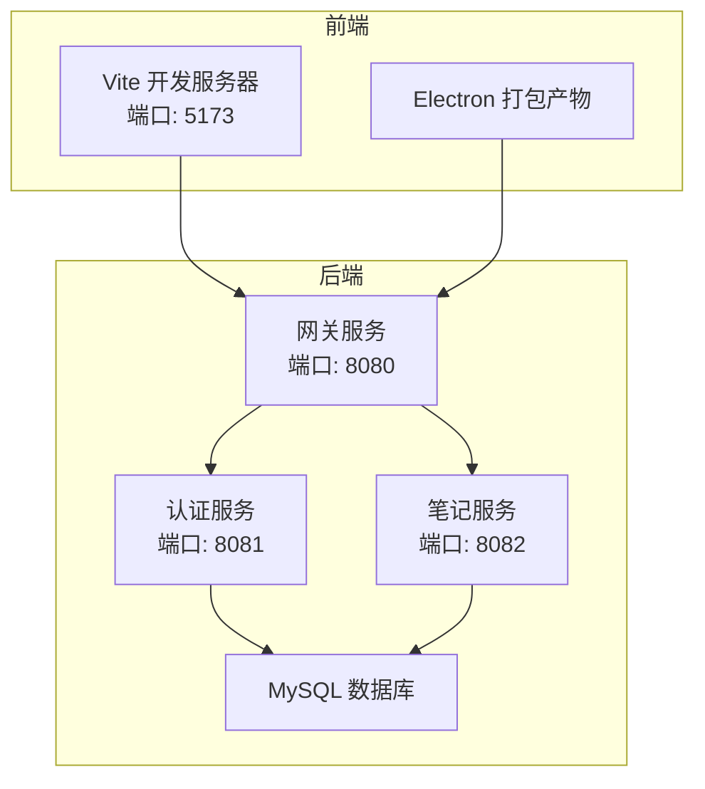
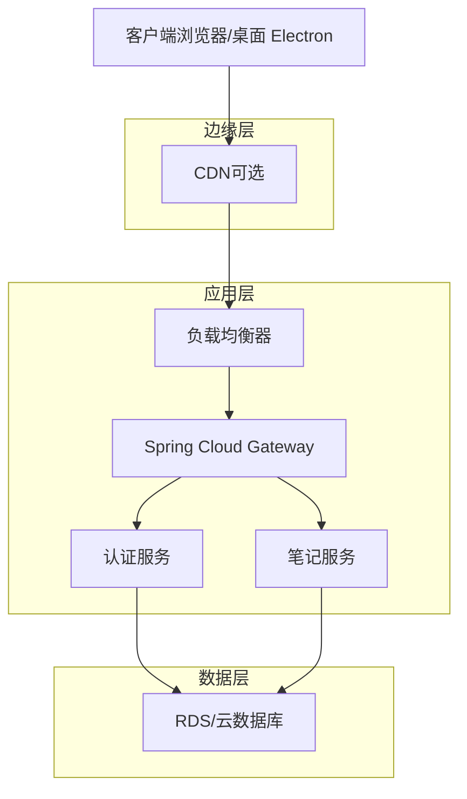
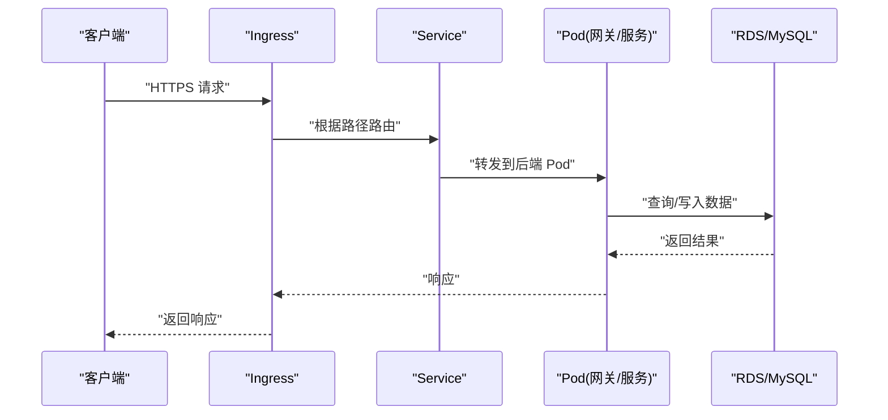
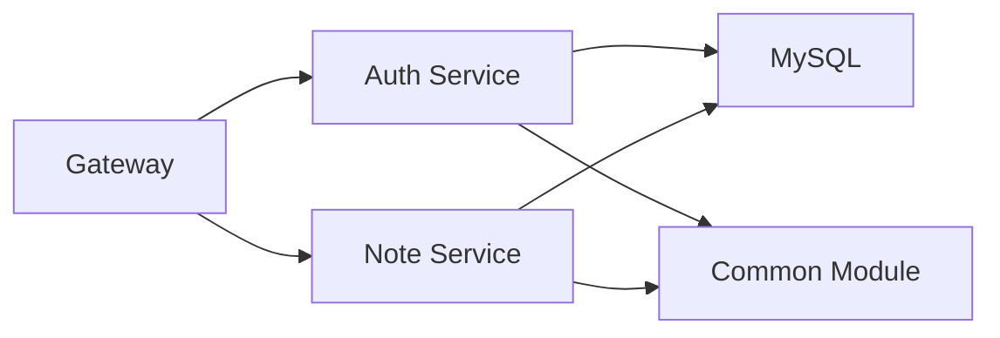
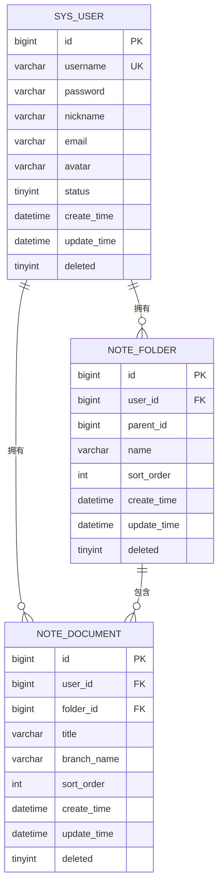

# 云平台部署

<cite>
**本文引用的文件**
- [README.md](file://README.md)
- [app/package.json](file://app/package.json)
- [app/vite.config.ts](file://app/vite.config.ts)
- [services/pom.xml](file://services/pom.xml)
- [services/gateway/src/main/resources/application.yml](file://services/gateway/src/main/resources/application.yml)
- [services/auth-service/src/main/resources/application.yml](file://services/auth-service/src/main/resources/application.yml)
- [services/note-service/src/main/resources/application.yml](file://services/note-service/src/main/resources/application.yml)
- [services/common/src/main/java/com/nonegonotes/common/entity/User.java](file://services/common/src/main/java/com/nonegonotes/common/entity/User.java)
- [services/common/src/main/java/com/nonegonotes/common/entity/Document.java](file://services/common/src/main/java/com/nonegonotes/common/entity/Document.java)
- [services/common/src/main/java/com/nonegonotes/common/entity/Folder.java](file://services/common/src/main/java/com/nonegonotes/common/entity/Folder.java)
- [services/sql/init.sql](file://services/sql/init.sql)
</cite>

## 目录
1. [简介](#简介)
2. [项目结构](#项目结构)
3. [核心组件](#核心组件)
4. [架构总览](#架构总览)
5. [详细组件分析](#详细组件分析)
6. [依赖关系分析](#依赖关系分析)
7. [性能考虑](#性能考虑)
8. [故障排查指南](#故障排查指南)
9. [结论](#结论)
10. [附录](#附录)

## 简介
本指南面向在多云平台（AWS、Azure、阿里云）及 Kubernetes 集群上部署 Woo（无我笔记）项目的工程团队。Woo 是一款基于桌面端 Electron + 前端 Vue 3 的 Markdown 写作与知识管理应用，后端采用 Spring Boot 3 + Spring Cloud Gateway 的微服务架构，使用 MySQL 作为持久化存储，并通过 JWT 进行认证。

本指南将从基础设施层到应用层给出可落地的部署步骤、架构建议、扩缩容与负载均衡策略、SSL 证书管理、监控与告警以及成本优化与安全最佳实践，帮助团队在不同云平台上实现稳定、高可用、可观测且成本可控的生产环境。

## 项目结构
Woo 项目由两大部分组成：
- 前端应用（Electron + Vue 3 + Vite）
- 后端微服务（Spring Boot + Spring Cloud Gateway + Nacos 服务发现）

图表来源
- [app/vite.config.ts:13-18](file://app/vite.config.ts#L13-L18)
- [services/gateway/src/main/resources/application.yml:1-27](file://services/gateway/src/main/resources/application.yml#L1-L27)
- [services/auth-service/src/main/resources/application.yml:1-40](file://services/auth-service/src/main/resources/application.yml#L1-L40)
- [services/note-service/src/main/resources/application.yml:1-35](file://services/note-service/src/main/resources/application.yml#L1-L35)

章节来源
- [README.md:12-45](file://README.md#L12-L45)
- [app/vite.config.ts:13-18](file://app/vite.config.ts#L13-L18)
- [services/pom.xml:15-20](file://services/pom.xml#L15-L20)

## 核心组件
- 前端（Electron + Vue 3 + Vite）
  - 开发服务器默认监听 5173 端口；构建产物输出至 dist 目录；Electron 打包入口为 electron/main.cjs。
- 网关服务（Spring Cloud Gateway）
  - 监听 8080 端口，路由规则将 /api/auth/** 转发至认证服务，将 /api/folders/** 与 /api/documents/** 转发至笔记服务；内置 JWT 密钥配置。
- 认证服务（Spring Boot）
  - 监听 8081 端口，使用 MySQL 数据源，集成 MyBatis Plus，启用 Knife4j 文档。
- 笔记服务（Spring Boot）
  - 监听 8082 端口，使用 MySQL 数据源，集成 MyBatis Plus，启用 Knife4j 文档。
- 数据库（MySQL）
  - 初始化脚本包含 sys_user、note_folder、note_document 表，定义了用户、目录与文稿元数据的结构。

章节来源
- [app/package.json:6-12](file://app/package.json#L6-L12)
- [app/vite.config.ts:13-18](file://app/vite.config.ts#L13-L18)
- [services/gateway/src/main/resources/application.yml:1-27](file://services/gateway/src/main/resources/application.yml#L1-L27)
- [services/auth-service/src/main/resources/application.yml:1-40](file://services/auth-service/src/main/resources/application.yml#L1-L40)
- [services/note-service/src/main/resources/application.yml:1-35](file://services/note-service/src/main/resources/application.yml#L1-L35)
- [services/sql/init.sql:9-54](file://services/sql/init.sql#L9-L54)

## 架构总览
Woo 的后端采用“网关 + 微服务 + 数据库”的三层架构。网关负责统一入口与路由转发，认证与笔记两个微服务分别处理用户认证与知识管理业务，数据库承载用户与文档元数据。

图表来源
- [services/gateway/src/main/resources/application.yml:11-22](file://services/gateway/src/main/resources/application.yml#L11-L22)
- [services/auth-service/src/main/resources/application.yml:7-12](file://services/auth-service/src/main/resources/application.yml#L7-L12)
- [services/note-service/src/main/resources/application.yml:7-12](file://services/note-service/src/main/resources/application.yml#L7-L12)

## 详细组件分析

### AWS 部署方案
- EC2 实例配置
  - 使用 Amazon Linux 2 或 2023，安装 JDK 17、Maven、MySQL 客户端与 Docker（如需容器化部署）。
  - 安全组开放 8080（网关）、8081（认证）、8082（笔记）、3306（MySQL），限制来源为负载均衡器或特定运维网段。
- ECS 容器服务
  - 构建后端镜像（基于 OpenJDK 17），推送至 ECR。
  - 在 ECS 中创建任务定义与服务，设置 CPU/内存配额，启用自动扩缩容（基于 CPU 使用率或自定义指标）。
  - 使用 Application Load Balancer（ALB）暴露 8080 端口，开启健康检查与会话亲缘性（如需要）。
- RDS 数据库服务
  - 选择 MySQL 8.x，启用多可用区与备份窗口，设置只读副本提升读扩展能力。
  - 将认证与笔记服务的数据库连接指向 RDS 内网地址，配置只读账号用于报表查询。
- CloudFront CDN
  - 若前端静态资源托管于 S3 + CloudFront，可将 CDN 作为网关上游的边缘缓存；对动态接口不建议缓存。
- SSL 证书管理
  - ACM 申请通配符证书，绑定 ALB 与 CloudFront；强制 HTTPS 重定向。
- 自动扩缩容与负载均衡
  - ECS 服务结合基于 CPU 的目标跟踪扩缩容策略；ALB 结合健康检查与多AZ部署。
- 监控与日志
  - CloudWatch Logs 收集应用日志；设置告警阈值（错误率、延迟、连接数）；结合 X-Ray 追踪请求链路。

章节来源
- [services/pom.xml:22-39](file://services/pom.xml#L22-L39)
- [services/gateway/src/main/resources/application.yml:1-27](file://services/gateway/src/main/resources/application.yml#L1-L27)
- [services/auth-service/src/main/resources/application.yml:7-12](file://services/auth-service/src/main/resources/application.yml#L7-L12)
- [services/note-service/src/main/resources/application.yml:7-12](file://services/note-service/src/main/resources/application.yml#L7-L12)

### Azure 部署流程
- 虚拟机部署
  - 使用 Ubuntu 22.04 LTS，安装 JDK 17、Maven、MySQL 客户端与 Docker。
  - 安全组开放 8080、8081、8082、3306，限制来源为 Azure Load Balancer 或运维网段。
- 容器实例（ACI/Azure Container Apps）
  - 构建后端镜像，推送到 Azure Container Registry。
  - 在 Container Apps 中创建环境与作业，配置 CPU/内存与自动扩缩容策略。
- Azure Database（MySQL/兼容 MySQL）
  - 创建 Flexible Server 或 Azure Database for MySQL，启用备份与高可用。
  - 将应用连接字符串指向内网 FQDN，配置只读副本与防火墙规则。
- CDN（Azure Front Door/CDN Standard）
  - 将静态资源经由 Azure CDN 分发；对动态接口不缓存。
- SSL 证书管理
  - 使用 Azure 证书（ACM Private CA 或第三方证书）绑定到 Front Door/Load Balancer。
- 负载均衡与扩缩容
  - 使用 Azure Load Balancer 或 Application Gateway；结合 VMSS 或 Container Apps 的自动扩缩容。
- 监控
  - Application Insights 收集应用遥测；Log Analytics 统一收集日志；设置告警。

章节来源
- [services/pom.xml:22-39](file://services/pom.xml#L22-L39)
- [services/gateway/src/main/resources/application.yml:1-27](file://services/gateway/src/main/resources/application.yml#L1-L27)
- [services/auth-service/src/main/resources/application.yml:7-12](file://services/auth-service/src/main/resources/application.yml#L7-L12)
- [services/note-service/src/main/resources/application.yml:7-12](file://services/note-service/src/main/resources/application.yml#L7-L12)

### 阿里云部署方案
- ECS 实例
  - CentOS 或 Alibaba Cloud Linux，安装 JDK 17、Maven、MySQL 客户端与 Docker。
  - 安全组放通 8080、8081、8082、3306，限制来源为 SLB 或运维网段。
- 容器服务（ACK/Serverless K8s）
  - 构建后端镜像，推送到阿里云镜像仓库。
  - 在 ACK 中创建 Deployment 与 Service，配置 HPA（基于 CPU/自定义指标）。
- RDS（云数据库）
  - 选择 MySQL 8.x，启用高可用与备份策略；配置只读实例提升读扩展。
- CDN（全站加速）
  - 将静态资源经由阿里云 CDN 加速；对动态接口不缓存。
- SSL 证书管理
  - 申请免费或付费证书，绑定 SLB/ALB 与 CDN。
- 负载均衡与扩缩容
  - SLB 暴露 8080；结合 HPA 与 Pod 横向扩缩容。
- 监控
  - ARMS/云监控收集指标与日志；设置告警。

章节来源
- [services/pom.xml:22-39](file://services/pom.xml#L22-L39)
- [services/gateway/src/main/resources/application.yml:1-27](file://services/gateway/src/main/resources/application.yml#L1-L27)
- [services/auth-service/src/main/resources/application.yml:7-12](file://services/auth-service/src/main/resources/application.yml#L7-L12)
- [services/note-service/src/main/resources/application.yml:7-12](file://services/note-service/src/main/resources/application.yml#L7-L12)

### Kubernetes 集群部署
- 集群准备
  - 使用 ACK 或自管集群，确保节点池具备足够 CPU/内存与磁盘。
- 镜像与密钥
  - 构建后端镜像并推送到镜像仓库；使用 Secret 存储数据库连接串、JWT 密钥与证书。
- Pod 与 Service
  - 为网关、认证、笔记服务分别创建 Deployment 与 ClusterIP Service。
- Ingress 路由
  - 部署 Ingress 控制器（如 Nginx/ALB Controller），配置路径路由到对应 Service。
- 横向扩缩容
  - 使用 HPA 基于 CPU/自定义指标进行扩缩容；必要时配置 PodDisruptionBudget。
- 存储与数据库
  - 将数据库迁移至 RDS/Azure Database/云数据库，避免在集群内运行有状态组件。
- SSL 与网络
  - 通过 Ingress TLS 或专用网关（如 API Gateway）终止 TLS；配置 NetworkPolicy 限制入站流量。

图表来源
- [services/gateway/src/main/resources/application.yml:11-22](file://services/gateway/src/main/resources/application.yml#L11-L22)
- [services/auth-service/src/main/resources/application.yml:7-12](file://services/auth-service/src/main/resources/application.yml#L7-L12)
- [services/note-service/src/main/resources/application.yml:7-12](file://services/note-service/src/main/resources/application.yml#L7-L12)

章节来源
- [services/pom.xml:22-39](file://services/pom.xml#L22-L39)
- [services/gateway/src/main/resources/application.yml:11-22](file://services/gateway/src/main/resources/application.yml#L11-L22)

### 自动扩缩容与负载均衡
- 扩缩容策略
  - 基于 CPU 使用率的目标跟踪策略；结合请求速率、错误率与队列长度等自定义指标。
  - 对网关与业务服务分别设置不同扩缩容阈值，避免热点导致级联放大。
- 负载均衡
  - ALB/SLB/Application Gateway 健康检查间隔与超时合理配置；启用多 AZ 与跨区域冗余。
- 会话亲缘性
  - 默认不启用粘性会话；若存在长连接或本地缓存，需谨慎评估。

章节来源
- [services/gateway/src/main/resources/application.yml:1-27](file://services/gateway/src/main/resources/application.yml#L1-L27)

### SSL 证书管理
- 证书来源
  - 使用 ACM/ACR/阿里云证书服务签发通配符证书；或通过 Let’s Encrypt 自动续期（需配合 DNS 验证）。
- 终止点
  - 在 ALB/SLB/Ingress/TLS 入口终止 TLS；后端服务间通信可使用 mTLS 或内网直连。
- 强制 HTTPS
  - 重定向 80 到 443；HSTS 头部按需启用。

章节来源
- [services/gateway/src/main/resources/application.yml:24-26](file://services/gateway/src/main/resources/application.yml#L24-L26)

### 云平台监控配置
- 指标与日志
  - CloudWatch（AWS）/Monitor（Azure）/云监控（阿里云）采集 CPU、内存、请求量、错误率、连接数。
  - 日志集中到 CloudWatch Logs/Log Analytics/日志服务，保留周期与归档策略明确。
- 告警
  - 设置多维度阈值告警（错误率、P95 延迟、连接池耗尽、磁盘水位）。
- 可观测性
  - 结合 X-Ray/App Insights/ARMS 进行分布式追踪；对关键路径埋点与采样策略。

章节来源
- [services/gateway/src/main/resources/application.yml:1-27](file://services/gateway/src/main/resources/application.yml#L1-L27)

## 依赖关系分析
后端微服务通过 Spring Cloud Gateway 提供统一入口，认证与笔记服务共享数据库与通用模块。

图表来源
- [services/pom.xml:15-20](file://services/pom.xml#L15-L20)
- [services/gateway/src/main/resources/application.yml:11-22](file://services/gateway/src/main/resources/application.yml#L11-L22)
- [services/auth-service/src/main/resources/application.yml:7-12](file://services/auth-service/src/main/resources/application.yml#L7-L12)
- [services/note-service/src/main/resources/application.yml:7-12](file://services/note-service/src/main/resources/application.yml#L7-L12)

章节来源
- [services/pom.xml:15-20](file://services/pom.xml#L15-L20)
- [services/gateway/src/main/resources/application.yml:11-22](file://services/gateway/src/main/resources/application.yml#L11-L22)

## 性能考虑
- 数据库性能
  - 读写分离与只读副本；索引覆盖常见查询路径；慢查询日志与执行计划分析。
- 应用性能
  - 连接池大小与超时配置；异步处理耗时任务；缓存热点数据（注意一致性）。
- 网络与传输
  - 合理的 Keep-Alive 与压缩策略；CDN 缓存静态资源；边缘计算就近分发。
- 成本优化
  - 选择合适的实例规格与计费模式（预留/节省计划/Spot）；自动扩缩容降低峰值成本。

## 故障排查指南
- 网关无法访问
  - 检查路由规则与服务名解析（Nacos/服务发现）；确认健康检查失败原因。
- 数据库连接异常
  - 校验连接串、账号权限与网络 ACL；查看连接池耗尽与慢查询。
- JWT 认证失败
  - 校验密钥一致与过期时间；检查网关过滤器是否正确传递令牌。
- 前端无法加载
  - 检查 Vite 构建产物与静态资源路径；CDN 缓存与 CORS 配置。

章节来源
- [services/gateway/src/main/resources/application.yml:11-26](file://services/gateway/src/main/resources/application.yml#L11-L26)
- [services/auth-service/src/main/resources/application.yml:7-12](file://services/auth-service/src/main/resources/application.yml#L7-L12)
- [services/note-service/src/main/resources/application.yml:7-12](file://services/note-service/src/main/resources/application.yml#L7-L12)

## 结论
通过将后端微服务容器化并结合云厂商的弹性与托管能力，Woo 可以在多云环境中实现高可用与低成本的交付。建议优先采用托管数据库与负载均衡，配合完善的监控与告警体系，持续优化扩缩容策略与网络路径，确保在不同云平台上的稳定性与可维护性。

## 附录
- 数据模型概览（用户、目录、文稿）

图表来源
- [services/common/src/main/java/com/nonegonotes/common/entity/User.java:11-39](file://services/common/src/main/java/com/nonegonotes/common/entity/User.java#L11-L39)
- [services/common/src/main/java/com/nonegonotes/common/entity/Folder.java:11-38](file://services/common/src/main/java/com/nonegonotes/common/entity/Folder.java#L11-L38)
- [services/common/src/main/java/com/nonegonotes/common/entity/Document.java:11-41](file://services/common/src/main/java/com/nonegonotes/common/entity/Document.java#L11-L41)
- [services/sql/init.sql:9-54](file://services/sql/init.sql#L9-L54)