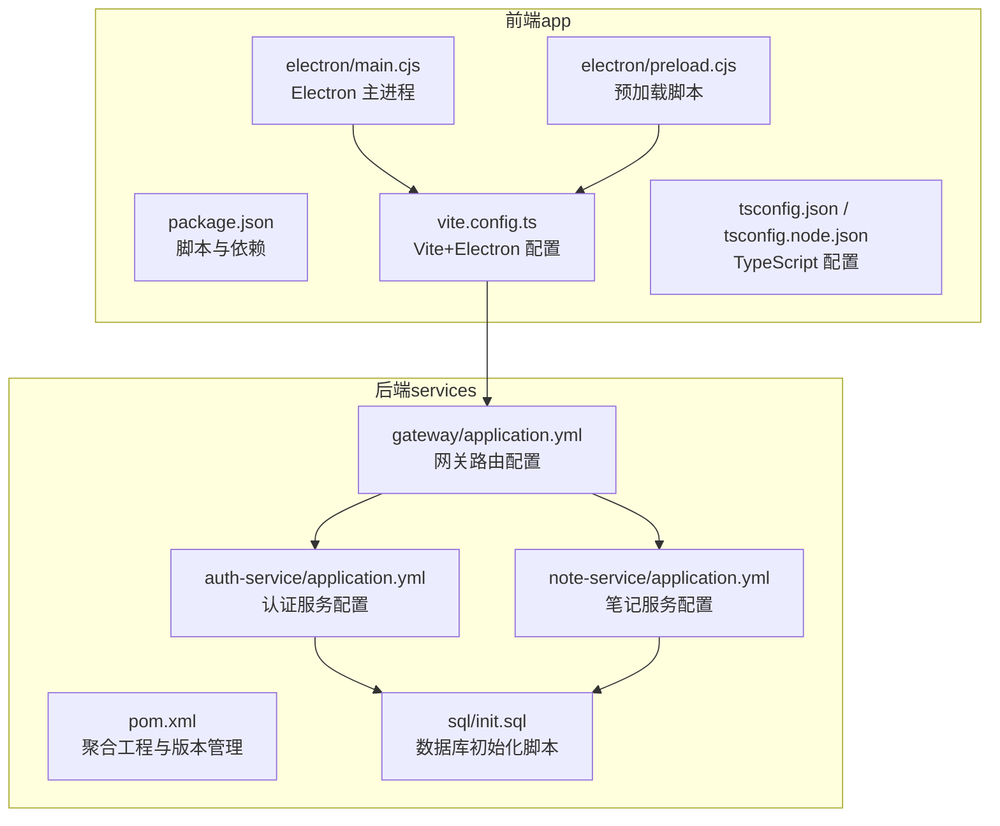
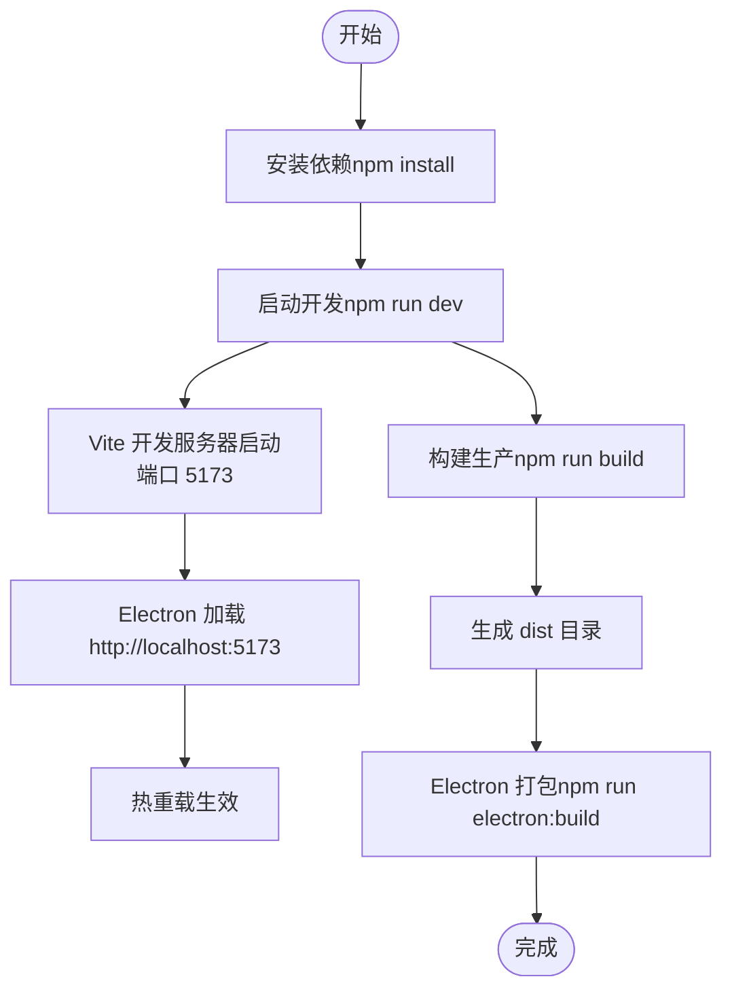
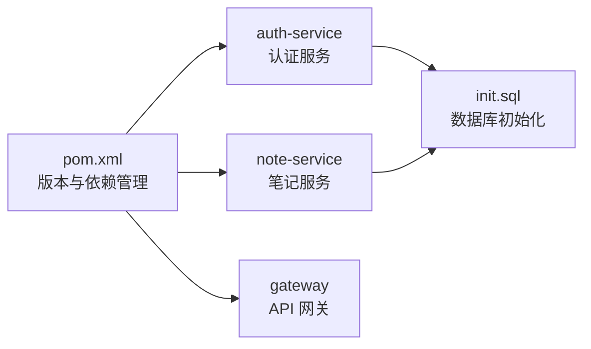
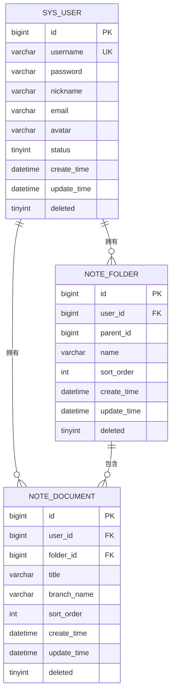
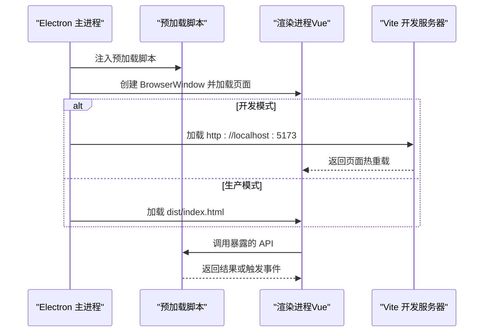
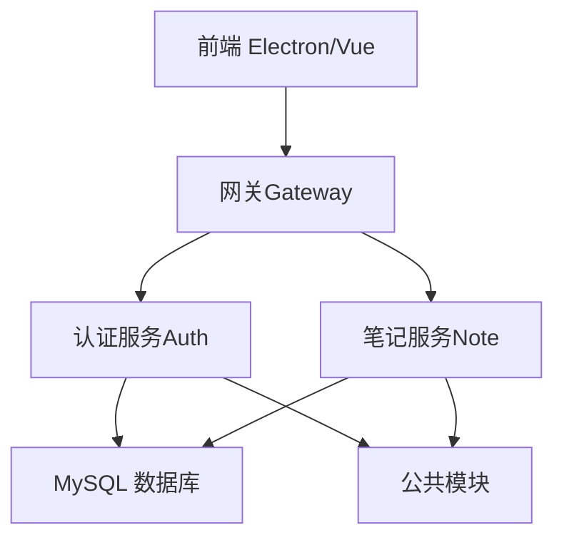

# 开发环境部署

<cite>
**本文引用的文件**
- [README.md](file://README.md)
- [package.json](file://app/package.json)
- [vite.config.ts](file://app/vite.config.ts)
- [tsconfig.json](file://app/tsconfig.json)
- [tsconfig.node.json](file://app/tsconfig.node.json)
- [main.cjs（Electron 主进程）](file://app/electron/main.cjs)
- [preload.cjs（Electron 预加载脚本）](file://app/electron/preload.cjs)
- [pom.xml（后端聚合工程）](file://services/pom.xml)
- [init.sql](file://services/sql/init.sql)
- [application.yml（认证服务）](file://services/auth-service/src/main/resources/application.yml)
- [application.yml（笔记服务）](file://services/note-service/src/main/resources/application.yml)
- [application.yml（网关）](file://services/gateway/src/main/resources/application.yml)
- [User.java（公共实体）](file://services/common/src/main/java/com/nonegonotes/common/entity/User.java)
- [Folder.java（公共实体）](file://services/common/src/main/java/com/nonegonotes/common/entity/Folder.java)
- [Document.java（公共实体）](file://services/common/src/main/java/com/nonegonotes/common/entity/Document.java)
</cite>

## 目录
1. [简介](#简介)
2. [项目结构](#项目结构)
3. [核心组件](#核心组件)
4. [架构总览](#架构总览)
5. [详细组件分析](#详细组件分析)
6. [依赖关系分析](#依赖关系分析)
7. [性能考虑](#性能考虑)
8. [故障排查指南](#故障排查指南)
9. [结论](#结论)
10. [附录](#附录)

## 简介
本指南面向希望在本地搭建并运行 Woo（无我笔记）项目的开发者，覆盖前端（Vue 3 + Electron）、后端（Spring Boot 微服务）、数据库（MySQL）以及 IDE 配置与验证流程。文档严格基于仓库中的实际配置文件，确保每一步操作均可复现。

## 项目结构
Woo 采用前后端分离的多模块结构：
- app：前端应用（Vue 3 + TypeScript + Vite），包含 Electron 主进程与预加载脚本
- services：后端微服务（Spring Boot + Spring Cloud），包含网关、认证服务、笔记服务与公共模块
- sql：数据库初始化脚本



图表来源
- [package.json:1-38](file://app/package.json#L1-L38)
- [vite.config.ts:1-19](file://app/vite.config.ts#L1-L19)
- [tsconfig.json:1-25](file://app/tsconfig.json#L1-L25)
- [tsconfig.node.json:1-11](file://app/tsconfig.node.json#L1-L11)
- [main.cjs（Electron 主进程）:1-71](file://app/electron/main.cjs#L1-L71)
- [preload.cjs（Electron 预加载脚本）:1-18](file://app/electron/preload.cjs#L1-L18)
- [pom.xml（后端聚合工程）:1-141](file://services/pom.xml#L1-L141)
- [application.yml（认证服务）:1-40](file://services/auth-service/src/main/resources/application.yml#L1-L40)
- [application.yml（笔记服务）:1-35](file://services/note-service/src/main/resources/application.yml#L1-L35)
- [application.yml（网关）:1-27](file://services/gateway/src/main/resources/application.yml#L1-L27)
- [init.sql:1-55](file://services/sql/init.sql#L1-L55)

章节来源
- [README.md:47-63](file://README.md#L47-L63)

## 核心组件
- 前端开发环境
  - Node.js 与 npm：用于安装依赖与运行脚本
  - Vite：开发服务器与构建工具，内置热重载
  - Electron：桌面端打包与运行
  - TypeScript：类型检查与构建
- 后端开发环境
  - JDK 17：Spring Boot 3 的最低要求
  - Maven：依赖与模块管理
  - Spring Boot 3 + Spring Cloud：微服务框架
- 数据库
  - MySQL：使用 JDBC 连接，Druid 连接池
  - 初始化脚本：创建数据库与三张核心表

章节来源
- [README.md:20-45](file://README.md#L20-L45)
- [pom.xml（后端聚合工程）:22-39](file://services/pom.xml#L22-L39)
- [application.yml（认证服务）:8-12](file://services/auth-service/src/main/resources/application.yml#L8-L12)
- [application.yml（笔记服务）:8-12](file://services/note-service/src/main/resources/application.yml#L8-L12)
- [application.yml（网关）:7-10](file://services/gateway/src/main/resources/application.yml#L7-L10)
- [init.sql:1-55](file://services/sql/init.sql#L1-L55)

## 架构总览
下图展示从 Electron 主进程到前端开发服务器与后端微服务的整体交互路径。

```mermaid
sequenceDiagram
participant User as "开发者"
participant Electron as "Electron 主进程"
participant Vite as "Vite 开发服务器"
participant Gateway as "Spring Cloud Gateway"
participant Auth as "认证服务"
participant Note as "笔记服务"
User->>Electron : 启动 Electron 应用
Electron->>Vite : 开发模式加载 http : //localhost : 5173
Vite-->>Electron : 返回前端页面热重载
User->>Gateway : 发起 /api/auth/** 或 /api/folders/** 请求
Gateway->>Auth : 路由转发至认证服务
Gateway->>Note : 路由转发至笔记服务
Auth-->>Gateway : 返回认证结果
Note-->>Gateway : 返回笔记数据
Gateway-->>User : 统一响应
```

图表来源
- [main.cjs（Electron 主进程）:26-31](file://app/electron/main.cjs#L26-L31)
- [vite.config.ts:13-15](file://app/vite.config.ts#L13-L15)
- [application.yml（网关）:11-22](file://services/gateway/src/main/resources/application.yml#L11-L22)
- [application.yml（认证服务）:1-40](file://services/auth-service/src/main/resources/application.yml#L1-L40)
- [application.yml（笔记服务）:1-35](file://services/note-service/src/main/resources/application.yml#L1-L35)

## 详细组件分析

### 前端开发环境配置
- Node.js 与 npm
  - 使用包管理器安装依赖后即可运行开发脚本
  - 参考脚本与入口配置
- Vite 开发服务器与热重载
  - 默认监听端口与构建输出目录
  - 内置 Electron 插件以支持桌面端开发
- TypeScript 配置
  - bundler 模式、严格模式、ESNext 模块解析
- Electron 开发与打包
  - 开发时加载本地 Vite 页面；生产时加载 dist/index.html
  - 预加载脚本通过 contextBridge 暴露受限 API



图表来源
- [package.json:6-12](file://app/package.json#L6-L12)
- [vite.config.ts:13-19](file://app/vite.config.ts#L13-L19)
- [main.cjs（Electron 主进程）:26-31](file://app/electron/main.cjs#L26-L31)
- [preload.cjs（Electron 预加载脚本）:1-18](file://app/electron/preload.cjs#L1-L18)
- [tsconfig.json:1-25](file://app/tsconfig.json#L1-L25)
- [tsconfig.node.json:1-11](file://app/tsconfig.node.json#L1-L11)

章节来源
- [README.md:22-36](file://README.md#L22-L36)
- [package.json:1-38](file://app/package.json#L1-L38)
- [vite.config.ts:1-19](file://app/vite.config.ts#L1-L19)
- [tsconfig.json:1-25](file://app/tsconfig.json#L1-L25)
- [tsconfig.node.json:1-11](file://app/tsconfig.node.json#L1-L11)
- [main.cjs（Electron 主进程）:1-71](file://app/electron/main.cjs#L1-L71)
- [preload.cjs（Electron 预加载脚本）:1-18](file://app/electron/preload.cjs#L1-L18)

### 后端开发环境设置
- JDK 17 与 Maven
  - Java 版本属性与 Maven 编译目标均为 17
  - 使用 Maven 安装依赖与打包
- Spring Boot 与 Spring Cloud
  - 通过 BOM 管理版本，启用 Web、MyBatis Plus、JWT、Druid、Knife4j 等依赖
- 微服务模块
  - 网关、认证服务、笔记服务各自独立运行
  - 网关负责路由转发与鉴权相关配置



图表来源
- [pom.xml（后端聚合工程）:22-39](file://services/pom.xml#L22-L39)
- [pom.xml（后端聚合工程）:41-120](file://services/pom.xml#L41-L120)
- [application.yml（网关）:1-27](file://services/gateway/src/main/resources/application.yml#L1-L27)
- [application.yml（认证服务）:1-40](file://services/auth-service/src/main/resources/application.yml#L1-L40)
- [application.yml（笔记服务）:1-35](file://services/note-service/src/main/resources/application.yml#L1-L35)
- [init.sql:1-55](file://services/sql/init.sql#L1-L55)

章节来源
- [pom.xml（后端聚合工程）:1-141](file://services/pom.xml#L1-L141)
- [application.yml（网关）:1-27](file://services/gateway/src/main/resources/application.yml#L1-L27)
- [application.yml（认证服务）:1-40](file://services/auth-service/src/main/resources/application.yml#L1-L40)
- [application.yml（笔记服务）:1-35](file://services/note-service/src/main/resources/application.yml#L1-L35)

### 数据库本地配置
- MySQL 安装与连接
  - 使用 JDBC 驱动连接本地数据库
  - 默认数据库名与字符集已在脚本中声明
- 初始化脚本
  - 创建数据库与三张核心表：用户、目录、文稿
- 实体映射
  - 公共模块中的实体类映射到对应表结构



图表来源
- [init.sql:9-23](file://services/sql/init.sql#L9-L23)
- [init.sql:25-38](file://services/sql/init.sql#L25-L38)
- [init.sql:40-54](file://services/sql/init.sql#L40-L54)
- [User.java（公共实体）:11-39](file://services/common/src/main/java/com/nonegonotes/common/entity/User.java#L11-L39)
- [Folder.java（公共实体）:11-38](file://services/common/src/main/java/com/nonegonotes/common/entity/Folder.java#L11-L38)
- [Document.java（公共实体）:11-41](file://services/common/src/main/java/com/nonegonotes/common/entity/Document.java#L11-L41)

章节来源
- [application.yml（认证服务）:8-12](file://services/auth-service/src/main/resources/application.yml#L8-L12)
- [application.yml（笔记服务）:8-12](file://services/note-service/src/main/resources/application.yml#L8-L12)
- [init.sql:1-55](file://services/sql/init.sql#L1-L55)
- [User.java（公共实体）:1-40](file://services/common/src/main/java/com/nonegonotes/common/entity/User.java#L1-L40)
- [Folder.java（公共实体）:1-39](file://services/common/src/main/java/com/nonegonotes/common/entity/Folder.java#L1-L39)
- [Document.java（公共实体）:1-42](file://services/common/src/main/java/com/nonegonotes/common/entity/Document.java#L1-L42)

### Electron 开发环境配置
- 开发模式
  - Electron 主进程在开发环境下加载 Vite 本地地址
  - 自动打开开发者工具
- 生产模式
  - Electron 主进程加载构建产物 dist/index.html
- 预加载脚本
  - 通过 contextBridge 暴露受控 API 至渲染进程
- 跨平台打包
  - 使用 electron-builder 进行跨平台打包（脚本中已配置）



图表来源
- [main.cjs（Electron 主进程）:26-31](file://app/electron/main.cjs#L26-L31)
- [preload.cjs（Electron 预加载脚本）:1-18](file://app/electron/preload.cjs#L1-L18)
- [package.json:10-11](file://app/package.json#L10-L11)
- [vite.config.ts:13-19](file://app/vite.config.ts#L13-L19)

章节来源
- [main.cjs（Electron 主进程）:1-71](file://app/electron/main.cjs#L1-L71)
- [preload.cjs（Electron 预加载脚本）:1-18](file://app/electron/preload.cjs#L1-L18)
- [package.json:1-38](file://app/package.json#L1-L38)
- [vite.config.ts:1-19](file://app/vite.config.ts#L1-L19)

### IDE 配置建议
- VS Code 插件推荐
  - Vue Language Features（Volar）：提供 Vue 3 类型支持
  - ESLint / Prettier：统一代码风格与质量
  - EditorConfig：保持团队一致的缩进与换行
  - TypeScript Importer：自动导入类型与模块
  - Spring Boot Extension Pack：增强 Spring Boot 开发体验
- TypeScript 配置
  - 严格模式、ESNext 模块解析、bundler 模式
- Spring Boot 调试设置
  - 为每个微服务创建独立的 Debug 配置，指定主类与 JVM 参数
  - 网关、认证服务、笔记服务分别监听不同端口，便于并行调试

章节来源
- [tsconfig.json:1-25](file://app/tsconfig.json#L1-L25)
- [tsconfig.node.json:1-11](file://app/tsconfig.node.json#L1-L11)
- [application.yml（网关）:1-27](file://services/gateway/src/main/resources/application.yml#L1-L27)
- [application.yml（认证服务）:1-40](file://services/auth-service/src/main/resources/application.yml#L1-L40)
- [application.yml（笔记服务）:1-35](file://services/note-service/src/main/resources/application.yml#L1-L35)

## 依赖关系分析
- 前端对后端的依赖
  - Electron 主进程在开发模式下依赖 Vite 本地服务
  - 网关作为统一入口，路由转发至认证与笔记服务
- 后端模块间依赖
  - 认证服务与笔记服务共享公共模块与数据库
  - 网关依赖 Nacos 服务发现（本地默认地址）
- 外部依赖
  - MySQL、Druid、JWT、Knife4j、MyBatis Plus



图表来源
- [main.cjs（Electron 主进程）:26-31](file://app/electron/main.cjs#L26-L31)
- [application.yml（网关）:11-22](file://services/gateway/src/main/resources/application.yml#L11-L22)
- [application.yml（认证服务）:13-16](file://services/auth-service/src/main/resources/application.yml#L13-L16)
- [application.yml（笔记服务）:13-16](file://services/note-service/src/main/resources/application.yml#L13-L16)
- [init.sql:1-55](file://services/sql/init.sql#L1-L55)

章节来源
- [pom.xml（后端聚合工程）:15-20](file://services/pom.xml#L15-L20)
- [application.yml（网关）:1-27](file://services/gateway/src/main/resources/application.yml#L1-L27)
- [application.yml（认证服务）:1-40](file://services/auth-service/src/main/resources/application.yml#L1-L40)
- [application.yml（笔记服务）:1-35](file://services/note-service/src/main/resources/application.yml#L1-L35)

## 性能考虑
- 前端
  - 使用 Vite 的按需加载与热重载提升开发效率
  - Electron 开发模式下仅加载必要资源，避免不必要的打包开销
- 后端
  - 使用 Druid 连接池与 MyBatis Plus 提升数据库访问性能
  - 合理配置 Knife4j 与日志级别，避免生产环境冗余输出
- 数据库
  - 初始化脚本中为常用查询字段建立索引，减少慢查询

## 故障排查指南
- 前端无法热重载或端口占用
  - 检查 Vite 配置的端口是否被占用
  - 清理 node_modules 并重新安装依赖
- Electron 开发模式空白页
  - 确认 Vite 已启动且可访问本地地址
  - 检查主进程加载逻辑与开发/生产模式分支
- 后端无法连接数据库
  - 校验 JDBC URL、用户名与密码
  - 确认数据库已执行初始化脚本
- 网关路由不生效
  - 检查网关路由配置与服务注册地址
  - 确认认证与笔记服务端口正确
- TypeScript 类型错误
  - 检查 tsconfig 的模块解析与严格模式配置
  - 确保类型声明文件完整

章节来源
- [vite.config.ts:13-19](file://app/vite.config.ts#L13-L19)
- [main.cjs（Electron 主进程）:26-31](file://app/electron/main.cjs#L26-L31)
- [application.yml（认证服务）:8-12](file://services/auth-service/src/main/resources/application.yml#L8-L12)
- [application.yml（笔记服务）:8-12](file://services/note-service/src/main/resources/application.yml#L8-L12)
- [application.yml（网关）:11-22](file://services/gateway/src/main/resources/application.yml#L11-L22)
- [tsconfig.json:1-25](file://app/tsconfig.json#L1-L25)

## 结论
通过本指南，您可以在本地完成前端、后端与数据库的完整开发环境搭建，并掌握 Electron 开发与调试要点。建议在开发过程中遵循 IDE 插件与 TypeScript 配置的最佳实践，确保代码质量与一致性。

## 附录
- 快速验证清单
  - 前端：进入 app 目录，安装依赖并启动开发服务器，确认热重载可用
  - Electron：运行 Electron 开发命令，确认加载本地页面并打开开发者工具
  - 后端：在 services 目录执行 Maven 安装，分别启动网关、认证与笔记服务
  - 数据库：执行初始化脚本，确认三张核心表存在且可连接
- 常用命令参考
  - 前端：安装依赖、启动开发、构建生产、Electron 打包
  - 后端：Maven 安装与打包
  - 数据库：执行 init.sql

章节来源
- [README.md:22-45](file://README.md#L22-L45)
- [package.json:6-12](file://app/package.json#L6-L12)
- [pom.xml（后端聚合工程）:122-139](file://services/pom.xml#L122-L139)
- [init.sql:1-55](file://services/sql/init.sql#L1-L55)