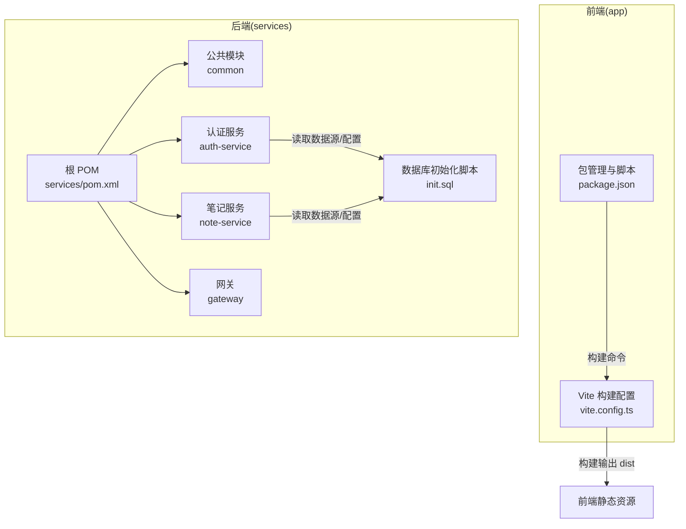
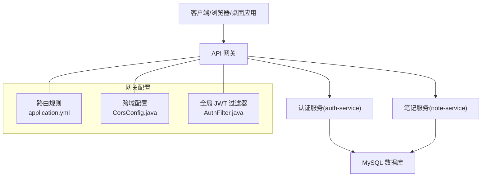
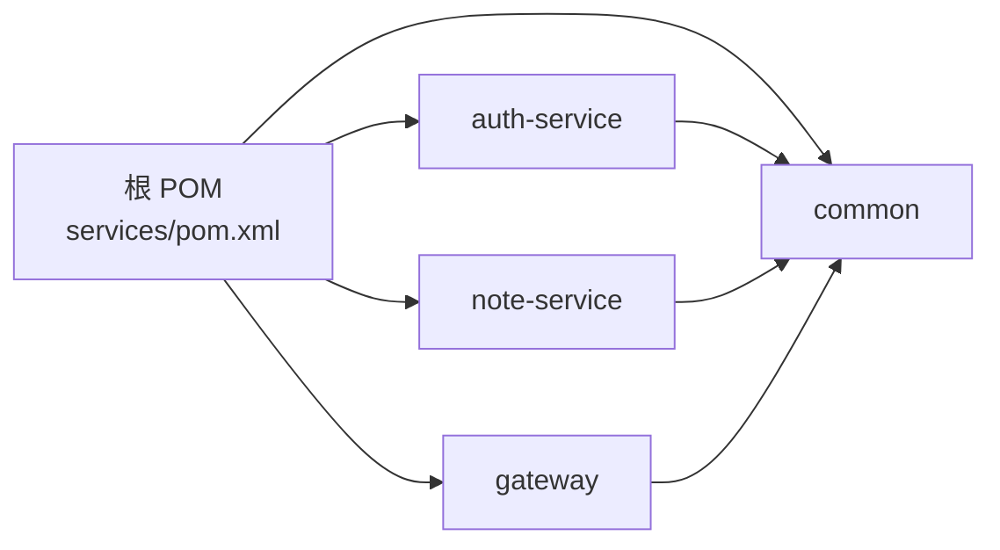

# 生产环境部署

<cite>
**本文引用的文件**
- [app/vite.config.ts](file://app/vite.config.ts)
- [app/package.json](file://app/package.json)
- [services/pom.xml](file://services/pom.xml)
- [services/auth-service/src/main/resources/application.yml](file://services/auth-service/src/main/resources/application.yml)
- [services/gateway/src/main/resources/application.yml](file://services/gateway/src/main/resources/application.yml)
- [services/note-service/src/main/resources/application.yml](file://services/note-service/src/main/resources/application.yml)
- [services/common/src/main/java/com/nonegonotes/common/util/JwtUtil.java](file://services/common/src/main/java/com/nonegonotes/common/util/JwtUtil.java)
- [services/auth-service/src/main/java/com/nonegonotes/auth/config/SecurityConfig.java](file://services/auth-service/src/main/java/com/nonegonotes/auth/config/SecurityConfig.java)
- [services/gateway/src/main/java/com/nonegonotes/gateway/filter/AuthFilter.java](file://services/gateway/src/main/java/com/nonegonotes/gateway/filter/AuthFilter.java)
- [services/gateway/src/main/java/com/nonegonotes/gateway/config/CorsConfig.java](file://services/gateway/src/main/java/com/nonegonotes/gateway/config/CorsConfig.java)
- [services/auth-service/src/main/java/com/nonegonotes/auth/controller/AuthController.java](file://services/auth-service/src/main/java/com/nonegonotes/auth/controller/AuthController.java)
- [services/note-service/src/main/java/com/nonegonotes/note/controller/DocumentController.java](file://services/note-service/src/main/java/com/nonegonotes/note/controller/DocumentController.java)
- [services/sql/init.sql](file://services/sql/init.sql)
- [README.md](file://README.md)
</cite>

## 目录
1. [简介](#简介)
2. [项目结构](#项目结构)
3. [核心组件](#核心组件)
4. [架构总览](#架构总览)
5. [详细组件分析](#详细组件分析)
6. [依赖关系分析](#依赖关系分析)
7. [性能考虑](#性能考虑)
8. [故障排查指南](#故障排查指南)
9. [结论](#结论)
10. [附录](#附录)

## 简介
本指南面向生产环境部署，覆盖前端生产构建与发布、后端微服务打包与运行、数据库生产配置、API网关路由与安全、JWT认证与SSL配置、域名绑定、监控与日志、以及部署验证与回滚策略。目标是帮助运维团队在生产环境中稳定、安全地交付系统。

## 项目结构
- 前端位于 app/，基于 Vue 3 + Vite + Electron，提供桌面端应用与网页端基础能力。
- 后端位于 services/，采用多模块 Maven 结构，包含公共模块 common、认证服务 auth-service、笔记服务 note-service、网关 gateway，以及数据库初始化脚本 sql/init.sql。
- README 提供了开发与构建的基本命令，便于理解前后端产物与运行方式。

图表来源
- [app/vite.config.ts:1-19](file://app/vite.config.ts#L1-L19)
- [app/package.json:1-38](file://app/package.json#L1-L38)
- [services/pom.xml:1-141](file://services/pom.xml#L1-L141)
- [services/sql/init.sql:1-55](file://services/sql/init.sql#L1-L55)

章节来源
- [README.md:47-63](file://README.md#L47-L63)

## 核心组件
- 前端生产构建：通过 Vite 进行类型检查与打包，输出静态资源至 dist 目录；Electron 构建脚本用于打包桌面应用。
- 微服务打包：根 POM 统一管理版本与插件，使用 spring-boot-maven-plugin 生成可执行 JAR；各子模块独立运行。
- 数据库：MySQL 初始化脚本定义用户、目录、文稿三张表，配合 MyBatis Plus 与 Druid 连接池。
- API 网关：Spring Cloud Gateway 路由到认证与笔记服务，并内置跨域与全局 JWT 认证过滤。
- 认证与授权：JWT 工具类与网关过滤器负责签发与校验；认证控制器提供登录注册接口。
- 监控与文档：Knife4j 在开发环境启用 OpenAPI 文档，生产建议接入集中式日志与指标采集。

章节来源
- [app/vite.config.ts:1-19](file://app/vite.config.ts#L1-L19)
- [app/package.json:6-12](file://app/package.json#L6-L12)
- [services/pom.xml:122-139](file://services/pom.xml#L122-L139)
- [services/auth-service/src/main/resources/application.yml:1-40](file://services/auth-service/src/main/resources/application.yml#L1-L40)
- [services/gateway/src/main/resources/application.yml:1-27](file://services/gateway/src/main/resources/application.yml#L1-L27)
- [services/note-service/src/main/resources/application.yml:1-35](file://services/note-service/src/main/resources/application.yml#L1-L35)
- [services/common/src/main/java/com/nonegonotes/common/util/JwtUtil.java:1-57](file://services/common/src/main/java/com/nonegonotes/common/util/JwtUtil.java#L1-L57)
- [services/gateway/src/main/java/com/nonegonotes/gateway/filter/AuthFilter.java:1-91](file://services/gateway/src/main/java/com/nonegonotes/gateway/filter/AuthFilter.java#L1-L91)
- [services/auth-service/src/main/java/com/nonegonotes/auth/controller/AuthController.java:1-31](file://services/auth-service/src/main/java/com/nonegonotes/auth/controller/AuthController.java#L1-L31)
- [services/note-service/src/main/java/com/nonegonotes/note/controller/DocumentController.java:1-49](file://services/note-service/src/main/java/com/nonegonotes/note/controller/DocumentController.java#L1-L49)
- [services/sql/init.sql:1-55](file://services/sql/init.sql#L1-L55)

## 架构总览
生产部署涉及三层：前端静态资源层、后端微服务层、数据库层。网关统一入口，负责路由、鉴权与跨域；认证服务处理登录注册与令牌签发；笔记服务处理文档与目录业务；数据库承载用户与笔记数据。

图表来源
- [services/gateway/src/main/resources/application.yml:11-22](file://services/gateway/src/main/resources/application.yml#L11-L22)
- [services/gateway/src/main/java/com/nonegonotes/gateway/config/CorsConfig.java:17-30](file://services/gateway/src/main/java/com/nonegonotes/gateway/config/CorsConfig.java#L17-L30)
- [services/gateway/src/main/java/com/nonegonotes/gateway/filter/AuthFilter.java:26-84](file://services/gateway/src/main/java/com/nonegonotes/gateway/filter/AuthFilter.java#L26-L84)
- [services/auth-service/src/main/resources/application.yml:8-12](file://services/auth-service/src/main/resources/application.yml#L8-L12)
- [services/note-service/src/main/resources/application.yml:8-12](file://services/note-service/src/main/resources/application.yml#L8-L12)

## 详细组件分析

### 前端生产构建与发布
- 构建命令与产物
  - 类型检查与打包：通过脚本触发类型检查与 Vite 打包，产物输出至 dist 目录。
  - Electron 构建：在完成前端构建后，调用 electron-builder 打包桌面应用。
- Vite 配置要点
  - 插件：启用 Vue 与 Electron 插件，开发服务器端口与构建输出目录已配置。
  - 生产优化：可在生产环境增加压缩、代码分割、资源指纹等策略（建议在实际部署时补充）。
- 发布建议
  - 将 dist 目录托管于 Nginx/Apache 或对象存储 CDN，开启 Gzip/Brotli 压缩与缓存策略。
  - 静态资源建议开启长期缓存与按需更新策略，HTML 采用短缓存或不缓存。

章节来源
- [app/package.json:6-12](file://app/package.json#L6-L12)
- [app/vite.config.ts:6-19](file://app/vite.config.ts#L6-L19)

### 后端微服务打包与进程管理
- 多模块结构
  - 根 POM 管理版本与插件，spring-boot-maven-plugin 在插件管理中统一配置 repackage 目标。
  - 子模块包含 common、auth-service、note-service、gateway。
- 打包与运行
  - 使用 mvn clean install 完成编译与测试；每个模块生成可执行 JAR。
  - 启动顺序：先启动注册中心（如 Nacos），再启动各微服务；网关作为统一入口。
- 进程管理
  - 建议使用 systemd（Linux）或 Windows 服务管理器进行守护与自动重启。
  - 为每个服务配置独立的 JVM 参数、日志目录与端口。

章节来源
- [services/pom.xml:122-139](file://services/pom.xml#L122-L139)
- [README.md:40-43](file://README.md#L40-L43)

### 数据库生产配置与性能优化
- 初始化脚本
  - 创建数据库 non_ego_notes，包含用户表 sys_user、目录表 note_folder、文稿表 note_document。
  - 表结构包含主键、唯一索引与常用查询索引，满足基本读写需求。
- 连接池与驱动
  - 数据源类型为 Druid，已在配置中声明；建议在生产配置文件中补充连接池参数（如初始大小、最小/最大空闲、最大等待时间、超时回收等）。
  - JDBC 驱动版本与 MySQL 版本匹配良好。
- 性能优化建议
  - 合理设置连接池大小以匹配并发访问峰值。
  - 对高频查询字段建立合适索引，避免全表扫描。
  - 启用慢查询日志与分析工具，定期审查热点 SQL。
  - 使用只读副本分担查询压力（如适用）。

章节来源
- [services/sql/init.sql:1-55](file://services/sql/init.sql#L1-L55)
- [services/auth-service/src/main/resources/application.yml:8-12](file://services/auth-service/src/main/resources/application.yml#L8-L12)
- [services/note-service/src/main/resources/application.yml:8-12](file://services/note-service/src/main/resources/application.yml#L8-L12)

### API 网关配置（路由、负载均衡、安全）
- 路由规则
  - 认证服务：/api/auth/** 路径转发至 lb://auth-service。
  - 笔记服务：/api/folders/**,/api/documents/** 路径转发至 lb://note-service。
- 负载均衡
  - 使用 lb:// 协议结合服务发现（Nacos）实现服务间负载均衡。
- 安全设置
  - 全局 JWT 过滤器：从 Authorization 请求头解析 Bearer Token，校验失败返回 401。
  - 白名单：对 /api/auth/login 与 /api/auth/register 放行。
  - 跨域：允许任意来源、方法与头部，支持凭据，设置预检缓存时长。
- 部署建议
  - 将网关暴露于公网，前置反向代理（如 Nginx/Tengine）统一入口与 SSL 终止。
  - 为网关配置健康检查与熔断降级策略。

章节来源
- [services/gateway/src/main/resources/application.yml:11-22](file://services/gateway/src/main/resources/application.yml#L11-L22)
- [services/gateway/src/main/java/com/nonegonotes/gateway/filter/AuthFilter.java:34-37](file://services/gateway/src/main/java/com/nonegonotes/gateway/filter/AuthFilter.java#L34-L37)
- [services/gateway/src/main/java/com/nonegonotes/gateway/filter/AuthFilter.java:50-58](file://services/gateway/src/main/java/com/nonegonotes/gateway/filter/AuthFilter.java#L50-L58)
- [services/gateway/src/main/java/com/nonegonotes/gateway/filter/AuthFilter.java:79-83](file://services/gateway/src/main/java/com/nonegonotes/gateway/filter/AuthFilter.java#L79-L83)
- [services/gateway/src/main/java/com/nonegonotes/gateway/config/CorsConfig.java:17-30](file://services/gateway/src/main/java/com/nonegonotes/gateway/config/CorsConfig.java#L17-L30)

### JWT 认证配置与令牌注入
- 令牌生成与解析
  - 使用 HMAC 算法与固定密钥生成与解析 JWT，包含签发时间与过期时间。
- 网关注入用户信息
  - 过滤器成功解析后，将 userId 与 username 注入请求头 X-User-Id 与 X-Username，供下游服务使用。
- 密钥管理
  - 生产环境应将密钥置于安全位置（如密钥管理系统），避免硬编码。
  - 建议定期轮换密钥并兼容旧密钥过渡。

章节来源
- [services/common/src/main/java/com/nonegonotes/common/util/JwtUtil.java:20-43](file://services/common/src/main/java/com/nonegonotes/common/util/JwtUtil.java#L20-L43)
- [services/gateway/src/main/java/com/nonegonotes/gateway/filter/AuthFilter.java:68-77](file://services/gateway/src/main/java/com/nonegonotes/gateway/filter/AuthFilter.java#L68-L77)

### SSL 证书部署与域名绑定
- 反向代理终止 SSL
  - 在网关前部署 Nginx/Tengine，配置 HTTPS 监听与证书链，将请求转发至网关 HTTP 端口。
- 域名绑定
  - 将域名解析到反向代理服务器 IP；在反向代理中配置 server_name 与证书路径。
- 安全加固
  - 强制 HTTPS 重定向，启用 HSTS；限制 TLS 版本与加密套件；定期更新证书。

（本节为通用实践说明，不直接分析具体文件）

### 生产环境监控配置（日志、性能、错误追踪）
- 日志
  - 后端建议使用结构化日志（JSON），输出到标准输出或文件，结合日志收集系统（如 ELK/Fluent Bit）集中存储与检索。
  - 分离访问日志与应用日志，设置滚动策略与保留周期。
- 性能监控
  - 集成 APM（如 SkyWalking/OpenTelemetry）采集链路追踪、指标与事务。
  - 关注网关与数据库的 QPS、延迟、错误率与连接池使用率。
- 错误追踪
  - 对未捕获异常与业务异常进行统一记录与告警；结合日志与追踪 ID 快速定位问题。

（本节为通用实践说明，不直接分析具体文件）

## 依赖关系分析
- 前端依赖
  - Vue 3、TypeScript、Pinia、Electron、Vite 插件等；构建脚本与插件版本明确。
- 后端依赖
  - Spring Boot 3、Spring Cloud、MyBatis Plus、MySQL Connector、Druid、JWT、Knife4j 等；版本在根 POM 中统一管理。
- 模块耦合
  - common 为共享模块，被 auth-service 与 note-service 引用；gateway 依赖服务发现与全局过滤器。

图表来源
- [services/pom.xml:15-20](file://services/pom.xml#L15-L20)
- [services/pom.xml:113-119](file://services/pom.xml#L113-L119)

章节来源
- [services/pom.xml:22-39](file://services/pom.xml#L22-L39)
- [services/pom.xml:41-120](file://services/pom.xml#L41-L120)

## 性能考虑
- 前端
  - 启用代码分割与懒加载，减少首屏体积；开启 Gzip/Brotli 压缩与长期缓存。
- 后端
  - 合理设置连接池大小与超时；对热点接口进行缓存（如用户信息）；数据库层面建立必要索引。
- 网关
  - 启用健康检查与限流熔断；对静态资源与非关键接口设置较宽松的超时与重试策略。

（本节为通用指导，不直接分析具体文件）

## 故障排查指南
- 登录失败
  - 检查网关是否正确转发请求至认证服务；确认 JWT 密钥一致且未被修改。
- 无权限访问
  - 核对网关白名单与路由配置；确认请求头携带有效的 Bearer Token。
- 数据库连接异常
  - 检查数据库地址、账号密码与网络连通性；核对连接池参数与最大连接数。
- 跨域问题
  - 确认网关 CORS 配置允许来源与方法；浏览器控制台查看预检请求结果。

章节来源
- [services/gateway/src/main/java/com/nonegonotes/gateway/filter/AuthFilter.java:34-37](file://services/gateway/src/main/java/com/nonegonotes/gateway/filter/AuthFilter.java#L34-L37)
- [services/gateway/src/main/java/com/nonegonotes/gateway/config/CorsConfig.java:17-30](file://services/gateway/src/main/java/com/nonegonotes/gateway/config/CorsConfig.java#L17-L30)
- [services/auth-service/src/main/resources/application.yml:8-12](file://services/auth-service/src/main/resources/application.yml#L8-L12)
- [services/note-service/src/main/resources/application.yml:8-12](file://services/note-service/src/main/resources/application.yml#L8-L12)

## 结论
本指南提供了从前端构建到后端微服务、数据库、网关与认证的完整生产部署思路。建议在实际落地时补充生产专用配置文件（如 application-prod.yml）、密钥管理、监控与告警体系，并制定标准化的 CI/CD 流水线与回滚策略。

## 附录

### 部署验证步骤
- 前端
  - 访问静态站点，确认页面可加载、资源可下载。
- 后端
  - 检查各服务健康状态与日志；验证数据库连接与表结构。
- 网关
  - 调用 /api/auth/login 获取 Token；使用该 Token 访问受保护接口。
- 安全
  - 确认 HTTPS 正常；跨域请求成功；白名单路径可匿名访问。

章节来源
- [services/auth-service/src/main/java/com/nonegonotes/auth/controller/AuthController.java:19-29](file://services/auth-service/src/main/java/com/nonegonotes/auth/controller/AuthController.java#L19-L29)
- [services/note-service/src/main/java/com/nonegonotes/note/controller/DocumentController.java:20-32](file://services/note-service/src/main/java/com/nonegonotes/note/controller/DocumentController.java#L20-L32)

### 回滚策略
- 前端
  - 保留上一个版本 dist 目录，回退至上一稳定版本。
- 后端
  - 保留上一个 JAR 包；通过进程管理器快速切换；必要时回滚数据库迁移。
- 网关与服务发现
  - 临时下线新版本服务，恢复旧版本；若涉及配置变更，回滚至上一配置版本。

（本节为通用实践说明，不直接分析具体文件）