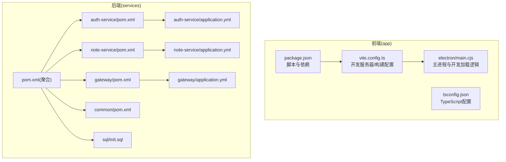
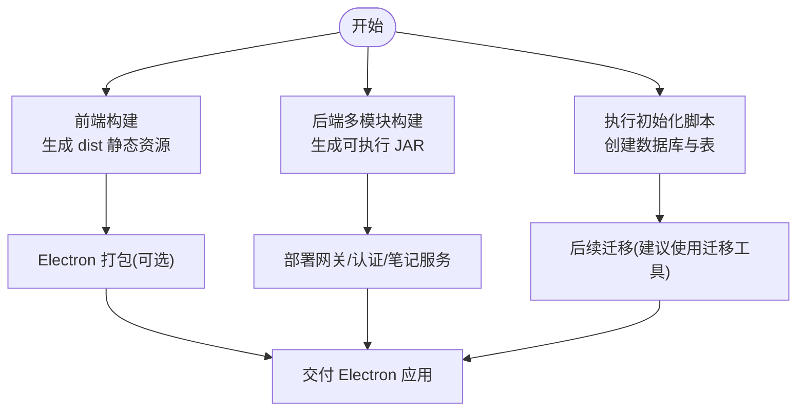
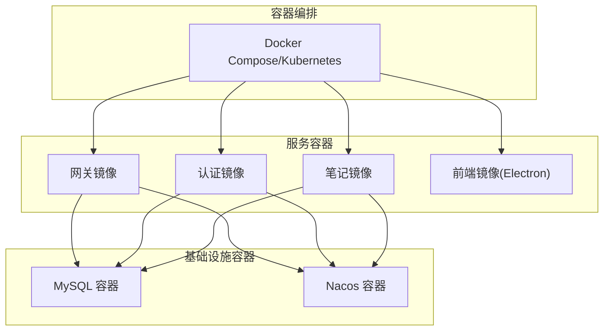
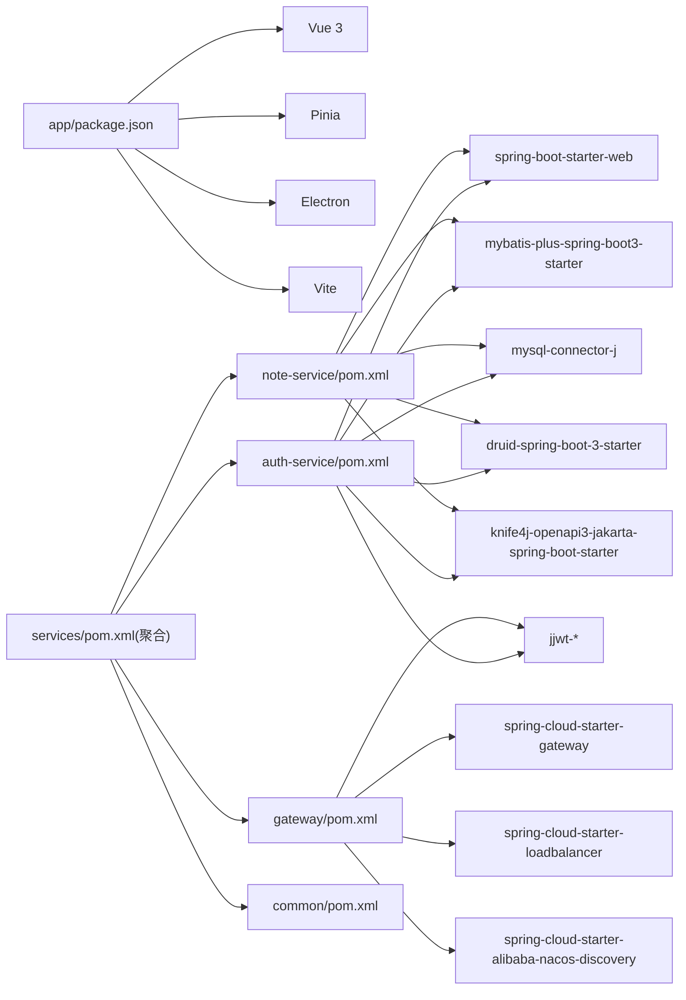

# 部署指南

<cite>
**本文引用的文件**
- [README.md](file://README.md)
- [app/package.json](file://app/package.json)
- [app/vite.config.ts](file://app/vite.config.ts)
- [app/electron/main.cjs](file://app/electron/main.cjs)
- [app/tsconfig.json](file://app/tsconfig.json)
- [services/pom.xml](file://services/pom.xml)
- [services/auth-service/pom.xml](file://services/auth-service/pom.xml)
- [services/note-service/pom.xml](file://services/note-service/pom.xml)
- [services/gateway/pom.xml](file://services/gateway/pom.xml)
- [services/common/pom.xml](file://services/common/pom.xml)
- [services/auth-service/src/main/resources/application.yml](file://services/auth-service/src/main/resources/application.yml)
- [services/note-service/src/main/resources/application.yml](file://services/note-service/src/main/resources/application.yml)
- [services/gateway/src/main/resources/application.yml](file://services/gateway/src/main/resources/application.yml)
- [services/sql/init.sql](file://services/sql/init.sql)
- [services/auth-service/src/main/java/com/nonegonotes/auth/AuthServiceApplication.java](file://services/auth-service/src/main/java/com/nonegonotes/auth/AuthServiceApplication.java)
- [services/note-service/src/main/java/com/nonegonotes/note/NoteServiceApplication.java](file://services/note-service/src/main/java/com/nonegonotes/note/NoteServiceApplication.java)
- [services/gateway/src/main/java/com/nonegonotes/gateway/GatewayApplication.java](file://services/gateway/src/main/java/com/nonegonotes/gateway/GatewayApplication.java)
- [services/common/src/main/java/com/nonegonotes/common/entity/User.java](file://services/common/src/main/java/com/nonegonotes/common/entity/User.java)
- [services/common/src/main/java/com/nonegonotes/common/util/JwtUtil.java](file://services/common/src/main/java/com/nonegonotes/common/util/JwtUtil.java)
</cite>

## 目录
1. [简介](#简介)
2. [项目结构](#项目结构)
3. [核心组件](#核心组件)
4. [架构总览](#架构总览)
5. [详细组件分析](#详细组件分析)
6. [依赖关系分析](#依赖关系分析)
7. [性能考虑](#性能考虑)
8. [故障排除指南](#故障排除指南)
9. [结论](#结论)
10. [附录](#附录)

## 简介
本指南面向Woo项目的部署实践，覆盖开发环境搭建、生产构建、微服务打包、数据库迁移策略、Docker容器化与编排、云平台部署、负载均衡与SSL、监控与日志、备份与灾备、安全加固以及部署验证与故障排除。项目采用前后端分离架构：前端基于Vue 3 + TypeScript + Electron + Vite；后端采用Spring Boot 3 + Spring Cloud Gateway微服务架构，使用MySQL与MyBatis Plus持久化，JWT进行认证。

## 项目结构
- 前端应用位于 app/，包含 Electron 主进程、Vite 构建配置、Vue 组件与类型定义。
- 后端服务位于 services/，包含网关、认证服务、笔记服务与公共模块，统一通过 Maven 多模块管理。
- 数据库初始化脚本位于 services/sql/init.sql。



**图表来源**
- [app/package.json:1-38](file://app/package.json#L1-L38)
- [app/vite.config.ts:1-19](file://app/vite.config.ts#L1-L19)
- [app/electron/main.cjs:1-71](file://app/electron/main.cjs#L1-L71)
- [app/tsconfig.json:1-25](file://app/tsconfig.json#L1-L25)
- [services/pom.xml:1-141](file://services/pom.xml#L1-L141)
- [services/auth-service/pom.xml:1-110](file://services/auth-service/pom.xml#L1-L110)
- [services/note-service/pom.xml:1-94](file://services/note-service/pom.xml#L1-L94)
- [services/gateway/pom.xml:1-72](file://services/gateway/pom.xml#L1-L72)
- [services/common/pom.xml:1-60](file://services/common/pom.xml#L1-L60)
- [services/auth-service/src/main/resources/application.yml:1-40](file://services/auth-service/src/main/resources/application.yml#L1-L40)
- [services/note-service/src/main/resources/application.yml:1-35](file://services/note-service/src/main/resources/application.yml#L1-L35)
- [services/gateway/src/main/resources/application.yml:1-27](file://services/gateway/src/main/resources/application.yml#L1-L27)
- [services/sql/init.sql:1-55](file://services/sql/init.sql#L1-L55)

**章节来源**
- [README.md:12-45](file://README.md#L12-L45)
- [app/package.json:6-12](file://app/package.json#L6-L12)
- [app/vite.config.ts:6-19](file://app/vite.config.ts#L6-L19)
- [services/pom.xml:15-20](file://services/pom.xml#L15-L20)

## 核心组件
- 前端开发与构建
  - 开发服务器：Vite 默认监听端口用于本地开发。
  - Electron 打包：使用 electron-builder 进行跨平台打包。
  - TypeScript 与 Vue：通过 bundler 模式与 Vue 插件配合。
- 后端微服务
  - 认证服务：负责用户认证与授权。
  - 笔记服务：目录与文档元数据管理。
  - 网关：路由转发与鉴权过滤。
  - 公共模块：共享实体、工具与异常处理。
- 数据库与迁移
  - 初始化脚本包含用户、目录、文稿三张表，含逻辑删除字段与索引。
- 认证与安全
  - JWT 密钥与过期策略在配置文件中定义，公共模块提供工具类。

**章节来源**
- [app/package.json:6-12](file://app/package.json#L6-L12)
- [app/vite.config.ts:6-19](file://app/vite.config.ts#L6-L19)
- [app/electron/main.cjs:26-31](file://app/electron/main.cjs#L26-L31)
- [services/auth-service/src/main/resources/application.yml:31-40](file://services/auth-service/src/main/resources/application.yml#L31-L40)
- [services/note-service/src/main/resources/application.yml:30-35](file://services/note-service/src/main/resources/application.yml#L30-L35)
- [services/gateway/src/main/resources/application.yml:24-27](file://services/gateway/src/main/resources/application.yml#L24-L27)
- [services/sql/init.sql:9-55](file://services/sql/init.sql#L9-L55)
- [services/common/src/main/java/com/nonegonotes/common/util/JwtUtil.java:15-57](file://services/common/src/main/java/com/nonegonotes/common/util/JwtUtil.java#L15-L57)

## 架构总览
系统采用前后端分离架构：前端 Electron 应用在开发时通过 Vite 代理访问后端网关；生产时 Electron 加载构建产物。后端以 Spring Cloud Gateway 作为统一入口，按路径将请求路由到认证与笔记服务，并通过 Nacos 进行服务发现。

```mermaid
graph TB
subgraph "客户端"
ELEC["Electron 应用"]
end
subgraph "网关层"
GW["Spring Cloud Gateway"]
end
subgraph "服务层"
AUTH["认证服务(auth-service)"]
NOTE["笔记服务(note-service)"]
end
subgraph "基础设施"
NACOS["Nacos 服务注册与发现"]
MYSQL["MySQL 数据库"]
end
ELEC --> GW
GW --> AUTH
GW --> NOTE
AUTH <- --> NACOS
NOTE <- --> NACOS
AUTH --> MYSQL
NOTE --> MYSQL
```

**图表来源**
- [services/gateway/src/main/resources/application.yml:11-23](file://services/gateway/src/main/resources/application.yml#L11-L23)
- [services/auth-service/src/main/resources/application.yml:13-16](file://services/auth-service/src/main/resources/application.yml#L13-L16)
- [services/note-service/src/main/resources/application.yml:13-16](file://services/note-service/src/main/resources/application.yml#L13-L16)
- [services/sql/init.sql:9-55](file://services/sql/init.sql#L9-L55)

## 详细组件分析

### 开发环境部署
- 前端
  - 安装依赖与启动开发服务器。
  - Vite 默认端口用于开发，Electron 在开发模式下加载本地开发地址。
  - TypeScript 与 Vue 插件配置确保类型检查与热重载。
- 后端
  - 使用 Maven 清理安装，多模块聚合构建。
  - 各微服务可独立启动，需先准备数据库与Nacos。

```mermaid
sequenceDiagram
participant Dev as "开发者"
participant FE as "前端(Vite)"
participant GW as "网关(gateway)"
participant AUTH as "认证(auth-service)"
participant NOTE as "笔记(note-service)"
Dev->>FE : 启动开发服务器
FE-->>Dev : 本地开发界面
Dev->>GW : 请求 /api/auth/**
GW->>AUTH : 路由转发
Dev->>GW : 请求 /api/folders/**,/api/documents/**
GW->>NOTE : 路由转发
```

**图表来源**
- [app/vite.config.ts:13-15](file://app/vite.config.ts#L13-L15)
- [app/electron/main.cjs:26-31](file://app/electron/main.cjs#L26-L31)
- [services/gateway/src/main/resources/application.yml:11-23](file://services/gateway/src/main/resources/application.yml#L11-L23)

**章节来源**
- [README.md:20-45](file://README.md#L20-L45)
- [app/package.json:6-12](file://app/package.json#L6-L12)
- [app/vite.config.ts:6-19](file://app/vite.config.ts#L6-L19)
- [app/electron/main.cjs:26-31](file://app/electron/main.cjs#L26-L31)

### 生产环境部署
- 前端构建与打包
  - 构建静态资源至 dist 目录，Electron 在生产模式加载该目录下的页面。
  - 可选：使用 electron-builder 进行应用打包。
- 后端微服务打包
  - 使用 Spring Boot Maven 插件对各模块进行打包，生成可执行 JAR。
  - 网关、认证、笔记服务分别独立运行，或通过容器编排统一管理。
- 数据库迁移策略
  - 使用初始化脚本创建数据库与表结构，包含逻辑删除与索引。
  - 建议在生产环境引入数据库迁移工具（如 Flyway/Liquibase）以管理后续变更。



**图表来源**
- [app/package.json:8-11](file://app/package.json#L8-L11)
- [app/vite.config.ts:16-18](file://app/vite.config.ts#L16-L18)
- [services/pom.xml:122-139](file://services/pom.xml#L122-L139)
- [services/sql/init.sql:1-55](file://services/sql/init.sql#L1-L55)

**章节来源**
- [README.md:20-45](file://README.md#L20-L45)
- [app/package.json:8-11](file://app/package.json#L8-L11)
- [app/vite.config.ts:16-18](file://app/vite.config.ts#L16-L18)
- [services/pom.xml:122-139](file://services/pom.xml#L122-L139)
- [services/sql/init.sql:1-55](file://services/sql/init.sql#L1-L55)

### Docker 容器化部署
- 前端 Electron 应用
  - 基于 Node.js 运行时构建镜像，挂载 dist 目录或直接内嵌静态资源。
- 后端微服务
  - 为每个服务创建独立镜像，暴露对应端口，依赖外部数据库与Nacos。
- 容器编排
  - 使用 Docker Compose 或 Kubernetes 管理服务生命周期、健康检查与网络。
- 关键注意事项
  - 数据库连接字符串、JWT 密钥、Nacos 地址等需通过环境变量注入。
  - 端口映射与持久化卷配置需与初始化脚本一致。



[本图为概念性容器编排示意，不直接映射具体源文件，故不提供图表来源]

### 云平台部署选项
- AWS
  - 使用 EC2/ECS/EKS 托管服务，结合 RDS、Route 53、ALB 与 ACM 实现高可用与自动扩缩容。
- Azure
  - 使用 AKS/Azure Container Instances，配合 Azure Database for MySQL、Azure DNS 与 Application Gateway。
- 阿里云
  - 使用 ACK/EDAS，结合 RDS、云解析与 SLB，实现稳定与合规的部署。
- 通用步骤
  - 准备镜像仓库与 CI/CD 流水线。
  - 配置安全组/防火墙与密钥管理。
  - 设置域名解析与 SSL 证书。

[本节为通用平台部署指导，不直接分析具体源文件，故不提供章节来源]

### 负载均衡、SSL 与域名
- 负载均衡
  - 网关层使用 Spring Cloud LoadBalancer 或云厂商 ALB/SLB。
- SSL 证书
  - 使用 ACM/Cert Manager/云平台证书服务签发与续期。
- 域名解析
  - 将域名指向负载均衡器，配置 CNAME/A 记录与强制 HTTPS。

[本节为通用运维指导，不直接分析具体源文件，故不提供章节来源]

### 监控与日志
- 应用性能监控
  - 后端集成 Actuator 与 Micrometer，采集指标并接入 Prometheus/Grafana。
- 错误追踪
  - 结合 Sentry 或自建 ELK/EFK，收集异常堆栈与调用链。
- 日志聚合
  - 使用 Filebeat/Fluent Bit 收集容器日志，集中存储于 Elasticsearch/OpenSearch。

[本节为通用监控指导，不直接分析具体源文件，故不提供章节来源]

### 备份、灾备与安全加固
- 备份策略
  - 数据库定时快照与增量备份，归档至对象存储。
- 灾难恢复
  - 多可用区部署，自动故障转移与回滚机制。
- 安全加固
  - 最小权限原则、密钥轮换、入站出站访问控制、WAF 与漏洞扫描。

[本节为通用安全部署指导，不直接分析具体源文件，故不提供章节来源]

## 依赖关系分析
- 前端
  - 依赖 Vue 3、Pinia、Electron 与 Vite 插件；开发与构建脚本在 package.json 中定义。
- 后端
  - 通过聚合 POM 管理版本与插件；各子模块声明 Web、MyBatis Plus、MySQL、Druid、JWT、Knife4j 等依赖。
- 数据与配置
  - 微服务各自维护 application.yml，包含数据库连接、Nacos 发现、JWT 配置与 Knife4j 文档开关。



**图表来源**
- [app/package.json:13-35](file://app/package.json#L13-L35)
- [services/pom.xml:41-120](file://services/pom.xml#L41-L120)
- [services/auth-service/pom.xml:26-98](file://services/auth-service/pom.xml#L26-L98)
- [services/note-service/pom.xml:26-82](file://services/note-service/pom.xml#L26-L82)
- [services/gateway/pom.xml:20-61](file://services/gateway/pom.xml#L20-L61)

**章节来源**
- [app/package.json:13-35](file://app/package.json#L13-L35)
- [services/pom.xml:41-120](file://services/pom.xml#L41-L120)
- [services/auth-service/pom.xml:26-98](file://services/auth-service/pom.xml#L26-L98)
- [services/note-service/pom.xml:26-82](file://services/note-service/pom.xml#L26-L82)
- [services/gateway/pom.xml:20-61](file://services/gateway/pom.xml#L20-L61)

## 性能考虑
- 前端
  - 合理拆分包与懒加载，减少首屏体积；构建时启用压缩与 Tree Shaking。
- 后端
  - 连接池参数优化、SQL 语句与索引调优、缓存策略（Redis）与异步处理。
- 网络
  - 启用 Gzip/Br 压缩、CDN 分发静态资源、合理设置缓存头。

[本节为通用性能指导，不直接分析具体源文件，故不提供章节来源]

## 故障排除指南
- 常见问题定位
  - 前端：确认开发服务器端口占用与跨域；Electron 开发模式下检查本地地址可达性。
  - 后端：核对 application.yml 中数据库连接、Nacos 地址与 JWT 密钥；查看 Knife4j 文档接口是否可用。
  - 数据库：确认初始化脚本执行成功，表结构与索引存在。
- 排障步骤
  - 逐项重启服务，观察日志输出；使用 curl 或 Postman 验证接口连通性。
  - 对比配置文件差异，确保环境变量与密钥正确注入。

**章节来源**
- [app/vite.config.ts:13-15](file://app/vite.config.ts#L13-L15)
- [app/electron/main.cjs:26-31](file://app/electron/main.cjs#L26-L31)
- [services/auth-service/src/main/resources/application.yml:8-16](file://services/auth-service/src/main/resources/application.yml#L8-L16)
- [services/note-service/src/main/resources/application.yml:8-16](file://services/note-service/src/main/resources/application.yml#L8-L16)
- [services/gateway/src/main/resources/application.yml:11-23](file://services/gateway/src/main/resources/application.yml#L11-L23)
- [services/sql/init.sql:1-55](file://services/sql/init.sql#L1-L55)

## 结论
本指南提供了从开发到生产的完整部署路径：前端开发服务器、Electron 打包与构建，后端微服务的独立与聚合打包，数据库初始化与迁移策略，以及容器化与云平台部署的通用方法。结合负载均衡、SSL 与域名解析、监控日志、备份灾备与安全加固，可形成一套稳健的生产级部署方案。

## 附录
- 部署验证清单
  - 前端：开发服务器可访问、Electron 可加载页面、构建产物可被 Electron 正常加载。
  - 后端：网关路由生效、认证与笔记服务可访问、数据库连接正常、JWT 令牌有效。
  - 基础设施：Nacos 注册中心可用、数据库初始化完成、SSL 证书与域名解析生效。
- 快速参考
  - 前端脚本与端口：参见前端 package.json 与 Vite 配置。
  - 后端端口与路由：参见网关 application.yml 的端口与路由规则。
  - 数据库初始化：参见初始化 SQL 文件。

**章节来源**
- [app/package.json:6-12](file://app/package.json#L6-L12)
- [app/vite.config.ts:6-19](file://app/vite.config.ts#L6-L19)
- [services/gateway/src/main/resources/application.yml:1-27](file://services/gateway/src/main/resources/application.yml#L1-L27)
- [services/sql/init.sql:1-55](file://services/sql/init.sql#L1-L55)