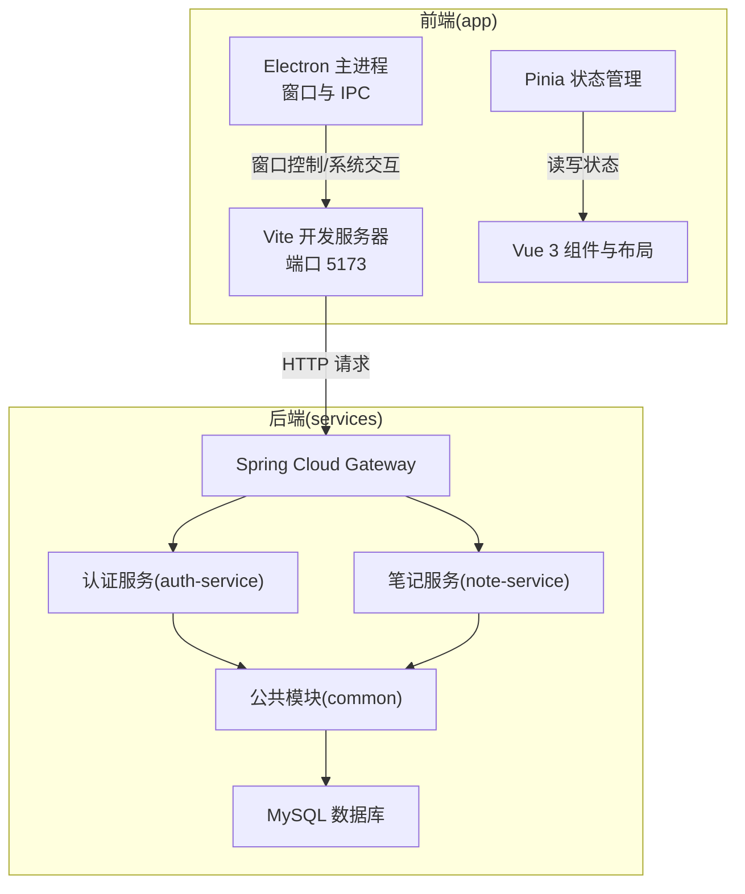
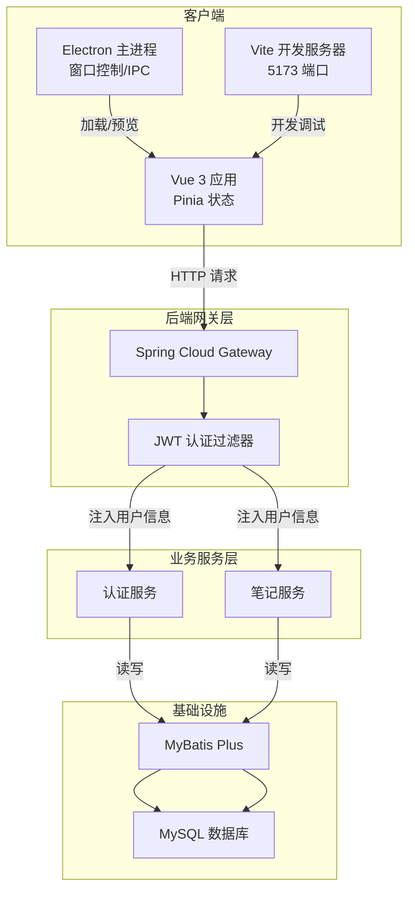
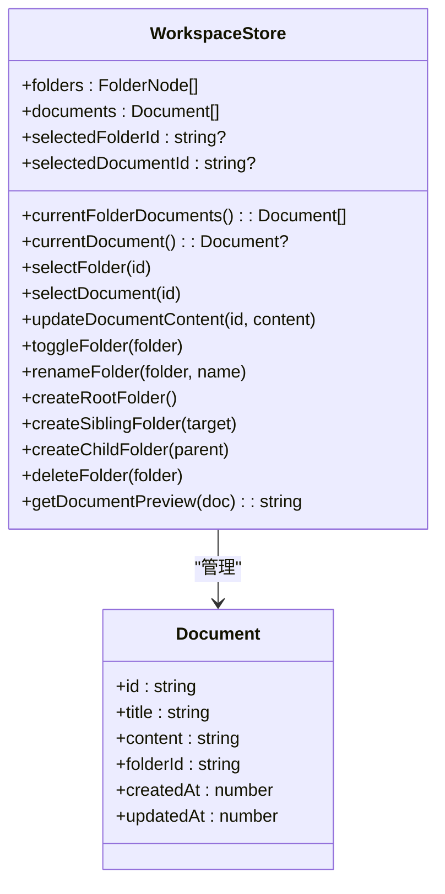
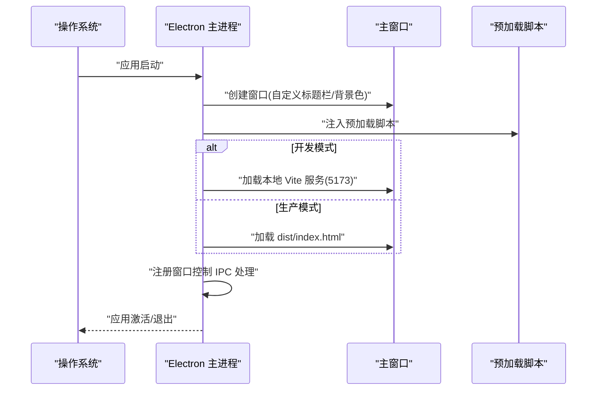
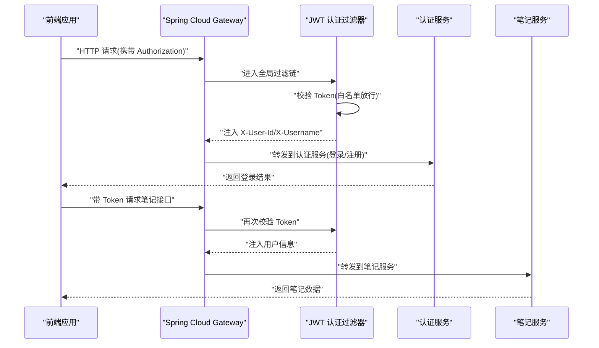
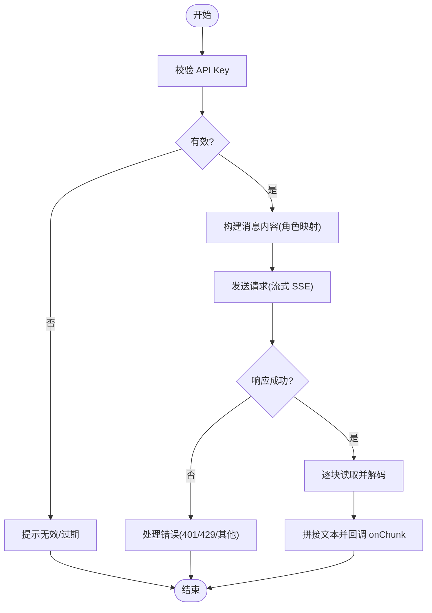
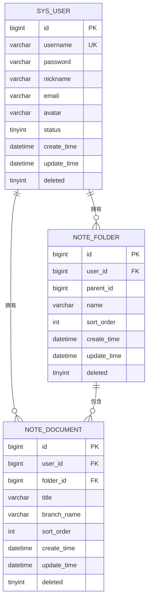
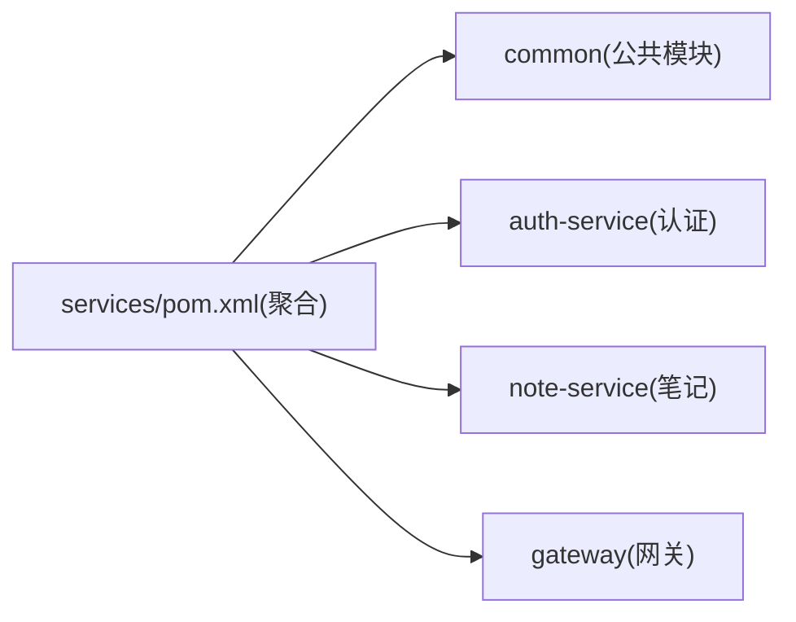

# 项目概述

<cite>
**本文引用的文件**
- [README.md](file://README.md)
- [app/package.json](file://app/package.json)
- [app/vite.config.ts](file://app/vite.config.ts)
- [app/src/main.ts](file://app/src/main.ts)
- [app/electron/main.cjs](file://app/electron/main.cjs)
- [app/src/stores/workspace.ts](file://app/src/stores/workspace.ts)
- [app/src/services/gemini.ts](file://app/src/services/gemini.ts)
- [app/src/types/document.ts](file://app/src/types/document.ts)
- [app/src/types/ai.ts](file://app/src/types/ai.ts)
- [services/pom.xml](file://services/pom.xml)
- [services/common/src/main/java/com/nonegonotes/common/entity/User.java](file://services/common/src/main/java/com/nonegonotes/common/entity/User.java)
- [services/common/src/main/java/com/nonegonotes/common/util/JwtUtil.java](file://services/common/src/main/java/com/nonegonotes/common/util/JwtUtil.java)
- [services/gateway/src/main/java/com/nonegonotes/gateway/filter/AuthFilter.java](file://services/gateway/src/main/java/com/nonegonotes/gateway/filter/AuthFilter.java)
- [services/auth-service/src/main/java/com/nonegonotes/auth/controller/AuthController.java](file://services/auth-service/src/main/java/com/nonegonotes/auth/controller/AuthController.java)
- [services/note-service/src/main/java/com/nonegonotes/note/controller/DocumentController.java](file://services/note-service/src/main/java/com/nonegonotes/note/controller/DocumentController.java)
- [services/sql/init.sql](file://services/sql/init.sql)
</cite>

## 目录
1. [引言](#引言)
2. [项目结构](#项目结构)
3. [核心组件](#核心组件)
4. [架构总览](#架构总览)
5. [详细组件分析](#详细组件分析)
6. [依赖关系分析](#依赖关系分析)
7. [性能考虑](#性能考虑)
8. [故障排查指南](#故障排查指南)
9. [结论](#结论)
10. [附录](#附录)

## 引言
Woo（无我笔记）是一款专注写作的 Markdown 桌面笔记软件，目标是为用户提供简洁、高效、可扩展的知识管理与创作体验。项目以“无我”理念为核心，强调内容本身的价值，减少干扰，帮助用户专注于写作与思考。

- 核心价值
  - 简洁的 Markdown 编辑体验：通过现代化编辑器与所见即所得的渲染，降低写作门槛。
  - Git 版本管理支持：内置版本追踪与回滚能力，保障创作过程的可追溯性。
  - 思维导图与大纲视图：多维度组织与浏览知识，提升结构化思维效率。
  - AI 辅助写作能力：集成大模型接口，提供智能提示、润色与扩写建议（规划中）。

- 设计理念
  - 分层清晰：前端采用 Vue 3 + Electron + Vite，后端采用 Spring Boot 3 + Spring Cloud 微服务，前后端职责明确、边界清晰。
  - 可演进性：模块化设计便于逐步引入 AI、Git 集成与可视化视图。
  - 易用性：从安装到运行、从本地开发到打包发布，提供清晰的开发与部署指引。

**章节来源**
- [README.md:1-72](file://README.md#L1-L72)

## 项目结构
项目采用前后端分离的双仓库结构：
- app：前端应用（Vue 3 + TypeScript + Pinia），桌面端通过 Electron + Vite 构建与打包。
- services：后端微服务（Spring Boot 3 + Spring Cloud），包含网关、认证服务、笔记服务与公共模块，统一使用 MyBatis Plus + MySQL 进行持久化。

**图表来源**
- [app/vite.config.ts:1-19](file://app/vite.config.ts#L1-L19)
- [app/electron/main.cjs:1-71](file://app/electron/main.cjs#L1-L71)
- [services/pom.xml:15-20](file://services/pom.xml#L15-L20)
- [services/gateway/src/main/java/com/nonegonotes/gateway/filter/AuthFilter.java:1-91](file://services/gateway/src/main/java/com/nonegonotes/gateway/filter/AuthFilter.java#L1-L91)

**章节来源**
- [README.md:47-63](file://README.md#L47-L63)
- [services/pom.xml:15-20](file://services/pom.xml#L15-L20)

## 核心组件
- 前端核心
  - 应用入口与状态：应用通过入口文件挂载，使用 Pinia 管理全局状态；工作区状态集中于工作区 Store，负责目录树、文稿列表与当前选中项。
  - 编辑与渲染：基于 Tiptap 的 Markdown 编辑器，配合 marked 渲染，提供实时预览与富文本支持。
  - 桌面端集成：Electron 主进程负责窗口生命周期、自定义标题栏与窗口控制；预加载脚本隔离 Node 与渲染上下文，保证安全。
  - 构建与开发：Vite 提供快速热更新与构建；脚本支持开发、构建与 Electron 打包。

- 后端核心
  - 网关与认证：Spring Cloud Gateway 作为统一入口，内置 JWT 认证过滤器，校验令牌并将用户信息注入下游请求头。
  - 认证服务：提供注册与登录接口，返回标准化响应。
  - 笔记服务：提供文稿的增删改查与按目录查询接口，使用 X-User-Id 请求头进行用户隔离。
  - 公共模块：包含实体、异常与工具类（如 JWT 工具），统一业务返回格式与异常处理。
  - 持久化：MyBatis Plus + MySQL，提供实体映射与逻辑删除支持。

**章节来源**
- [app/src/main.ts:1-8](file://app/src/main.ts#L1-L8)
- [app/src/stores/workspace.ts:1-321](file://app/src/stores/workspace.ts#L1-L321)
- [app/electron/main.cjs:1-71](file://app/electron/main.cjs#L1-L71)
- [services/gateway/src/main/java/com/nonegonotes/gateway/filter/AuthFilter.java:1-91](file://services/gateway/src/main/java/com/nonegonotes/gateway/filter/AuthFilter.java#L1-L91)
- [services/auth-service/src/main/java/com/nonegonotes/auth/controller/AuthController.java:1-31](file://services/auth-service/src/main/java/com/nonegonotes/auth/controller/AuthController.java#L1-L31)
- [services/note-service/src/main/java/com/nonegonotes/note/controller/DocumentController.java:1-49](file://services/note-service/src/main/java/com/nonegonotes/note/controller/DocumentController.java#L1-L49)
- [services/common/src/main/java/com/nonegonotes/common/util/JwtUtil.java:1-57](file://services/common/src/main/java/com/nonegonotes/common/util/JwtUtil.java#L1-L57)

## 架构总览
Woo 的整体架构由“桌面端 + 微服务后端 + 关系型数据库”构成。前端通过 Vite 进行开发与构建，Electron 将 Web 应用封装为原生桌面程序；后端通过 Spring Cloud Gateway 实现统一入口与鉴权，认证服务负责用户凭证校验，笔记服务承载业务数据操作。

**图表来源**
- [app/vite.config.ts:1-19](file://app/vite.config.ts#L1-L19)
- [app/electron/main.cjs:1-71](file://app/electron/main.cjs#L1-L71)
- [services/gateway/src/main/java/com/nonegonotes/gateway/filter/AuthFilter.java:1-91](file://services/gateway/src/main/java/com/nonegonotes/gateway/filter/AuthFilter.java#L1-L91)
- [services/pom.xml:22-39](file://services/pom.xml#L22-L39)

## 详细组件分析

### 前端应用与状态管理
- 应用入口与插件
  - 入口文件创建 Vue 应用并挂载 Pinia，随后渲染根组件。
  - Vite 插件配置启用 Vue 与 Electron 集成，开发时自动加载本地服务。
- 工作区 Store
  - 维护目录树、文稿列表与当前选中项，提供目录展开/折叠、重命名、创建/删除目录、文稿内容更新与预览文本生成等方法。
  - 通过计算属性实现当前目录下文稿的筛选与排序，简化 UI 层逻辑。
- 类型与服务
  - 文档类型定义了标题、HTML 内容、所属目录与时间戳字段。
  - AI 类型定义聊天消息与模型配置，支撑后续 AI 功能接入。

**图表来源**
- [app/src/stores/workspace.ts:1-321](file://app/src/stores/workspace.ts#L1-L321)
- [app/src/types/document.ts:1-9](file://app/src/types/document.ts#L1-L9)

**章节来源**
- [app/src/main.ts:1-8](file://app/src/main.ts#L1-L8)
- [app/vite.config.ts:1-19](file://app/vite.config.ts#L1-L19)
- [app/src/stores/workspace.ts:1-321](file://app/src/stores/workspace.ts#L1-L321)
- [app/src/types/document.ts:1-9](file://app/src/types/document.ts#L1-L9)

### 桌面端集成（Electron）
- 窗口与 IPC
  - 主进程创建窗口，支持最小化、最大化/还原、关闭等窗口控制；通过 IPC 与渲染进程通信。
  - 开发模式下加载本地 Vite 服务，生产模式加载打包后的静态页面。
- 安全与隔离
  - 启用上下文隔离，禁用 Node 集成，避免渲染进程直接访问系统资源。
- 应用数据目录
  - 自定义用户数据目录，便于跨平台存储与调试。

**图表来源**
- [app/electron/main.cjs:1-71](file://app/electron/main.cjs#L1-L71)

**章节来源**
- [app/electron/main.cjs:1-71](file://app/electron/main.cjs#L1-L71)

### 网关与认证流程
- 网关过滤器
  - 对未在白名单内的请求校验 Authorization 头中的 Bearer Token。
  - 使用对称密钥解析 JWT，成功则将 userId 与 username 注入请求头，透传给下游服务。
- 认证服务
  - 提供注册与登录接口，返回标准化响应对象。
- 笔记服务
  - 通过请求头中的 X-User-Id 实现用户隔离，确保数据安全。

**图表来源**
- [services/gateway/src/main/java/com/nonegonotes/gateway/filter/AuthFilter.java:1-91](file://services/gateway/src/main/java/com/nonegonotes/gateway/filter/AuthFilter.java#L1-L91)
- [services/auth-service/src/main/java/com/nonegonotes/auth/controller/AuthController.java:1-31](file://services/auth-service/src/main/java/com/nonegonotes/auth/controller/AuthController.java#L1-L31)
- [services/note-service/src/main/java/com/nonegonotes/note/controller/DocumentController.java:1-49](file://services/note-service/src/main/java/com/nonegonotes/note/controller/DocumentController.java#L1-L49)

**章节来源**
- [services/gateway/src/main/java/com/nonegonotes/gateway/filter/AuthFilter.java:1-91](file://services/gateway/src/main/java/com/nonegonotes/gateway/filter/AuthFilter.java#L1-L91)
- [services/auth-service/src/main/java/com/nonegonotes/auth/controller/AuthController.java:1-31](file://services/auth-service/src/main/java/com/nonegonotes/auth/controller/AuthController.java#L1-L31)
- [services/note-service/src/main/java/com/nonegonotes/note/controller/DocumentController.java:1-49](file://services/note-service/src/main/java/com/nonegonotes/note/controller/DocumentController.java#L1-L49)

### AI 辅助写作（概念与实现要点）
- 接口与模型
  - 通过 Gemini API 提供流式对话能力，支持角色映射与分片输出。
  - 提供 API Key 校验与错误分类（无效、频率限制、其他错误）。
- 前端集成
  - 定义聊天消息与模型配置类型，便于在界面中展示与选择模型。
- 实施建议
  - 建议在前端 Store 中新增 AI 会话状态，结合流式输出逐步拼接完整回复。
  - 在设置面板中提供模型选择与 API Key 管理。

**图表来源**
- [app/src/services/gemini.ts:1-103](file://app/src/services/gemini.ts#L1-L103)
- [app/src/types/ai.ts:1-20](file://app/src/types/ai.ts#L1-L20)

**章节来源**
- [app/src/services/gemini.ts:1-103](file://app/src/services/gemini.ts#L1-L103)
- [app/src/types/ai.ts:1-20](file://app/src/types/ai.ts#L1-L20)

### 持久化与数据模型
- 数据库初始化
  - 初始化数据库、用户表、目录表与文稿表，包含主键、索引与逻辑删除字段。
- 实体与映射
  - 用户实体包含基础字段与逻辑删除，便于软删除与审计。
- 服务层交互
  - 认证服务与笔记服务通过公共模块的实体与工具类进行数据访问与业务处理。

**图表来源**
- [services/sql/init.sql:1-55](file://services/sql/init.sql#L1-L55)
- [services/common/src/main/java/com/nonegonotes/common/entity/User.java:1-40](file://services/common/src/main/java/com/nonegonotes/common/entity/User.java#L1-L40)

**章节来源**
- [services/sql/init.sql:1-55](file://services/sql/init.sql#L1-L55)
- [services/common/src/main/java/com/nonegonotes/common/entity/User.java:1-40](file://services/common/src/main/java/com/nonegonotes/common/entity/User.java#L1-L40)

## 依赖关系分析
- 前端依赖
  - Vue 3、Pinia、Tiptap、marked 等用于构建编辑体验与状态管理。
  - Vite、Electron、electron-builder 用于开发与打包。
- 后端依赖
  - Spring Boot 3、Spring Cloud、MyBatis Plus、MySQL、JWT、Knife4j 等构成微服务生态。
- 模块划分
  - services 作为聚合工程，拆分为 common、auth-service、note-service、gateway 四个模块，职责清晰、便于独立部署与扩展。

**图表来源**
- [services/pom.xml:15-20](file://services/pom.xml#L15-L20)

**章节来源**
- [app/package.json:1-38](file://app/package.json#L1-L38)
- [services/pom.xml:15-20](file://services/pom.xml#L15-L20)

## 性能考虑
- 前端
  - 使用 Vite 的快速冷启动与热更新，缩短开发反馈周期。
  - Pinia 状态集中管理，避免重复渲染；对大型目录树与文稿列表建议虚拟滚动与懒加载。
- 后端
  - 网关层统一鉴权与限流策略，避免下游服务重复校验。
  - MyBatis Plus 启用逻辑删除与索引优化，减少全表扫描。
- 桌面端
  - Electron 主进程与渲染进程分离，IPC 通信避免阻塞 UI；合理使用预加载脚本与上下文隔离。

[本节为通用指导，无需列出具体文件来源]

## 故障排查指南
- 认证失败
  - 确认请求头是否包含有效的 Bearer Token；检查网关白名单配置与过滤器逻辑。
  - 若返回 401，检查 JWT 密钥与签名是否匹配。
- 数据访问异常
  - 核对数据库初始化脚本与实体映射，确认表名、字段与索引是否存在。
  - 检查服务间调用是否正确传递 X-User-Id 请求头。
- 前端开发问题
  - 开发模式下确认 Vite 服务端口开放；生产模式确认打包产物存在且路径正确。
  - Electron 窗口无法加载：检查主进程加载逻辑与预加载脚本注入。

**章节来源**
- [services/gateway/src/main/java/com/nonegonotes/gateway/filter/AuthFilter.java:1-91](file://services/gateway/src/main/java/com/nonegonotes/gateway/filter/AuthFilter.java#L1-L91)
- [services/sql/init.sql:1-55](file://services/sql/init.sql#L1-L55)
- [app/vite.config.ts:1-19](file://app/vite.config.ts#L1-L19)
- [app/electron/main.cjs:1-71](file://app/electron/main.cjs#L1-L71)

## 结论
Woo 以简洁、可演进的方式整合了现代前端技术与微服务后端，既满足初学者的易用需求，也为有经验的开发者提供了清晰的扩展空间。通过统一的网关与 JWT 认证、模块化的服务设计与完善的开发脚手架，项目具备良好的可维护性与可扩展性。随着 AI 辅助写作、Git 集成与可视化视图的逐步落地，Woo 将成为专注写作与知识管理的理想工具。

[本节为总结性内容，无需列出具体文件来源]

## 附录
- 快速开始
  - 前端：进入 app 目录，安装依赖后分别启动开发服务器与 Electron 打包。
  - 后端：进入 services 目录，执行 Maven 安装命令，独立启动各微服务。
- 数据库
  - 使用提供的初始化脚本创建数据库与表结构，确保连接参数正确。

**章节来源**
- [README.md:20-45](file://README.md#L20-L45)
- [services/sql/init.sql:1-55](file://services/sql/init.sql#L1-L55)