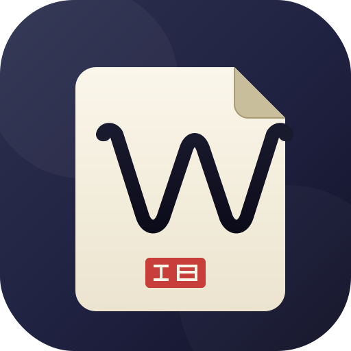

<p align="center">
  
</p>

<h1 align="center">Woo · 无我笔记</h1>

<p align="center">
  <strong>本地优先的跨平台 Markdown 笔记应用</strong>
</p>

<p align="center">
  <a href="https://github.com/stophemo/Woo/releases/latest">
    
  </a>
  <a href="https://github.com/stophemo/Woo/blob/main/LICENSE">
    
  </a>
  <a href="https://woo-notes.vercel.app">
    
  </a>
</p>

<p align="center">
  <b>桌面端</b> · <b>Android</b> · <b>iOS</b>（就绪中）
</p>

<br>

Woo 是一个本地优先的 Markdown 笔记应用，基于 **Tauri v2**、**Vue 3** 和 **SQLite** 构建。数据默认存储在你的设备上，无需注册即可使用全部核心功能。登录后可选择开启 Supabase 云端同步，实现多设备间的数据互通。

> 「无我」出自佛教哲学，意为超越自我执念。以此命名，是希望提供一个简洁、干净的写作环境，让写作回归文字本身。

---

## ✨ 功能特性

### 💾 本地存储，数据自主

所有笔记以 SQLite 数据库文件形式存储在本地，你可以随时复制、备份或迁移。不需要注册账号、不需要联网、不需要启动后端服务。下载安装后即可使用，数据不受任何外部服务约束。

### ✍️ 所见即所得编辑

基于 Tiptap / ProseMirror 的富文本编辑器，支持标题、列表、代码块、引用、表格等常见 Markdown 格式。编辑与渲染合一，无需在编辑和预览模式间切换。编辑器带有自动保存机制（内容变更 800ms 后落盘），避免意外丢失。

### 📂 文件夹与草稿

支持多层级文件夹树组织笔记，文档可在文件夹间拖拽排序。未分类的笔记自动归入草稿区（以 localStorage 暂存），整理后再移入正式文件夹。

### 🖥️ 📱 跨平台（桌面 + 移动端）

基于 Tauri v2 构建，一套代码编译到多个平台：
- **桌面端**：macOS (Apple Silicon + Intel)、Windows、Linux
- **移动端**：Android、iOS（开发中，欢迎参与）

### ☁️ 可选云同步

登录后可开启 Supabase 同步，在多台设备间共享笔记数据。同步采用最后写入胜出策略解决冲突，通过增量推拉和墓碑标记传播删除操作。不登录即为纯本地模式，同步是可选项，不是依赖项。

### ⏳ 版本历史

基于内容变更的自动快照保存，支持查看差异和回滚到任意历史版本，每文档最多保留 50 条版本历史。

### 🤖 AI 助手

聊天面板内置 AI 助手，可接入 DeepSeek、Google Gemini 或任意兼容 OpenAI 接口的服务（需自备 API 密钥）。助手通过工具调用与本地笔记数据交互：语义检索、创建/修改笔记、流式写入等。

### 📤 多格式导出

支持将笔记导出为 Markdown、PDF 和思维导图（PNG / SVG），满足分享、打印、归档等场景。

---

## 📥 下载

| 平台 | 下载 |
|------|------|
| macOS (Apple Silicon) | [GitHub Releases](https://github.com/stophemo/Woo/releases/latest) |
| Windows | [GitHub Releases](https://github.com/stophemo/Woo/releases/latest) |
| Linux | [GitHub Releases](https://github.com/stophemo/Woo/releases/latest) |
| Android | [GitHub Releases](https://github.com/stophemo/Woo/releases/latest) |
| iOS | 即将推出 |

---

## 🛠️ 开发

```bash
# 进入项目目录
cd app-tauri

# 安装前端依赖
npm install

# 开发模式（桌面端）
npm run tauri:dev

# 构建桌面版
npm run tauri:build

# 开发模式（Android）
npm run tauri:android:dev

# 构建 Android 版
npm run tauri:android:build
```

### 技术栈

| 层 | 技术 |
|----|------|
| 桌面框架 | Tauri v2 (Rust) |
| 前端框架 | Vue 3 + TypeScript |
| 状态管理 | Pinia |
| 编辑器 | Tiptap (ProseMirror) |
| 数据库 | SQLite (rusqlite, bundled) |
| 云同步 | Supabase (REST API) |
| AI | DeepSeek / Gemini API |

---

## 📄 许可证

[MIT](LICENSE) © 2026 Stophemo

---

## 🌐 相关链接

- [项目主页](https://woo-notes.vercel.app)
- [Electron 旧版](https://github.com/stophemo/Woo/tree/electron)（已迁移至 Tauri）
