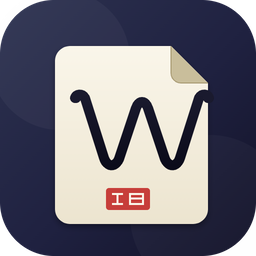

<p align="center">
  
</p>

<h1 align="center">无我笔记 Woo</h1>

<p align="center">
  <strong>跨平台云同步 · Markdown 笔记应用</strong>
</p>

<p align="center">
  <a href="https://github.com/stophemo/Woo/releases"></a>
  <a href="LICENSE"></a>
  <a href="https://github.com/stophemo/Woo/releases"></a>
  <a href="https://github.com/stophemo/Woo/stargazers"></a>
</p>

<p align="center">
  <a href="https://woo-notes.vercel.app">🌐 官网</a> ·
  <a href="https://github.com/stophemo/Woo/releases/latest">📦 下载</a> ·
  <a href="#-开发">🛠️ 开发</a> ·
  <a href="#-路线图">🗺️ 路线图</a>
</p>

---

## ✨ 为什么选择 Woo

Woo（无我笔记）是一款支持云端同步的 Markdown 笔记应用。在手机、电脑、平板上无缝切换，写作体验始终如一。

| | |
|---|---|
| ☁️ **云端同步** | 基于 Supabase 的多设备实时同步，增量推拉 + 冲突检测 |
| 📝 **所见即所得** | Tiptap 富文本编辑器，Markdown 语法实时转换 |
| 🤖 **AI 辅助** | 集成 Gemini + DeepSeek，续写、摘要、翻译、头脑风暴 |
| ⏱️ **版本历史** | 自动保存 + 手动快照，随时回退到任意历史版本 |
| 📶 **离线可用** | 所有数据本地留存，断网也能写作，恢复后自动同步 |
| 🔒 **隐私安全** | 开源透明，密码锁保护，数据经过你的 Supabase 项目传输 |
| 🎨 **极简设计** | 温暖柔和的日间主题 + 护眼暗色主题 |
| 🌍 **跨平台** | macOS · Windows · Linux · Android，同一套代码 |

---

## 📦 下载

| 平台 | 下载 | 说明 |
|------|------|------|
| 🍎 macOS | [DMG (Apple Silicon)](https://github.com/stophemo/Woo/releases/latest) | 正式包使用 Developer ID 签名并完成 Apple 公证 |
| 🪟 Windows | [NSIS 安装包 (x64)](https://github.com/stophemo/Woo/releases/latest) | 双击安装 |
| 🤖 Android | [已签名 APK (ARM64)](https://github.com/stophemo/Woo/releases/latest) | 支持 `arm64-v8a`，安装时允许来自此来源的应用 |
| 🐧 Linux | 即将推出 | 或从源码编译（见下方） |

> 💡 **macOS 用户**：正式发布包使用 Apple Developer ID 签名并完成公证，无需安装任何额外证书。临时测试 DMG 不等同于正式公证包；若 Release 明确标注为临时未签名测试包，请在 Finder 中右键应用并选择“打开”，或前往“系统设置 → 隐私与安全”选择“仍要打开”。切勿导入第三方信任根；若曾按旧版说明导入 Woo 自签信任根，请立即从“钥匙串访问”中删除。

---

## 🚀 快速开始（用户）

1. 前往 [Releases](https://github.com/stophemo/Woo/releases/latest) 下载对应平台安装包
2. 安装并启动
3. 开始写作——你的笔记自动保存在本地
4. （可选）登录 Supabase 账号启用云同步
5. （可选）在设置中配置 AI API Key

---

## 🛠️ 开发

### 技术栈

| 层 | 技术 |
|---|---|
| 桌面框架 | [Tauri v2](https://v2.tauri.app/) (Rust) |
| 前端 | Vue 3 + Pinia + Vite + TypeScript |
| 编辑器 | Tiptap (ProseMirror) |
| 数据库 | SQLite (rusqlite, bundled) |
| 云服务 | Supabase (Auth + REST API) |
| 移动端 | Tauri Mobile (Android / iOS) |

### 项目结构

```
Woo/
├── src/                    # 桌面端前端 (Vue 3, ESM)
│   ├── stores/             # Pinia 状态管理 (workspace, auth, sync, lock…)
│   ├── services/           # IPC 客户端 + AI 服务 (api.ts, gemini, deepseek…)
│   ├── components/         # 桌面端 UI 组件 (layout/, settings/)
│   └── types/              # TypeScript 类型定义
├── src-mobile/             # 移动端前端 (Vue 3 + Vant UI)
│   ├── views/              # 移动端页面
│   └── router/             # 移动端路由
├── src-tauri/              # Rust 后端 (桌面端 + 移动端共用)
│   ├── src/
│   │   ├── commands/       # Tauri IPC 命令入口
│   │   ├── services/       # 业务逻辑 (folder, document, sync_engine…)
│   │   ├── db/             # SQLite 连接管理 + Schema 迁移
│   │   ├── supabase/       # Supabase REST API 客户端
│   │   └── models/         # 数据模型
│   └── gen/android/        # Android 项目骨架
├── landing/                # 官网落地页 (部署于 Vercel)
├── index.html              # 桌面端入口
├── index-mobile.html       # 移动端入口
├── vite.config.ts          # 桌面端 Vite 配置
└── vite.mobile.config.ts   # 移动端 Vite 配置
```

### 构建命令

```bash
# 桌面端
npm install                  # 安装前端依赖
npm run dev                  # 启动 Vite 开发服务器 (localhost:5173)
npm run tauri:dev            # Tauri 开发模式（自动启动 Vite + Rust 编译）
npm run build                # vue-tsc + vite build（仅前端）
npm run tauri:build          # 生产构建（含 Rust release 编译）

# 移动端
npm run dev:mobile           # 移动端 Vite 服务器 (localhost:5174)
npm run tauri:android:dev    # Android 开发模式（连接真机）
npm run tauri:android:build  # Android 生产构建
```

### IPC 约定

```
Vue 组件 → api.ts invoke() → Tauri Command (Rust) → Service → SQLite
                    ↓                                             ↓
              自动拆包 { ok, data }                          Supabase (同步时)
```

- 所有 Rust 命令返回 `CommandResult<T> { ok, data?, message? }`
- 前端 `api.ts` 自动解包：`ok=false` 抛异常，原始值直接透传
- IPC 格式：`namespace:action`（如 `document:listByFolder`），参数为对象

> ⚠️ 禁止直接 `import { invoke }` —— 一律走 `services/api.ts`

### 数据库

未登录 → `woo.db`，登录后 → `woo-{username}.db`（首次登录自动迁移）。

| 表 | 说明 |
|---|---|
| `note_folder` | 文件夹树，`parent_id` 层级结构，软删除三态 |
| `note_document` | 文档，HTML `content`，标题从第一行自动提取 |
| `note_document_version` | 版本历史 (auto / manual / restore) |
| `sync_meta` | 键值存储 (last_sync_time, last_tombstone_pull) |

**软删除三态**：`deleted = 0` 正常 → `1` 回收站 → `2` 待硬删除（7 天清理窗口）

### 同步引擎

60 秒间隔运行，流程：拉墓碑 → 拉远端 → 推本地 → 清理 → 墓碑 GC。采用最后写入胜出 + 增量同步 + 冲突副本保护策略。

---

## 🗺️ 路线图

- [ ] 完成云同步 (Supabase Auth + Sync Engine)
- [ ] macOS 原生菜单 + 完整快捷键
- [ ] Homebrew Cask 分发
- [ ] iOS 支持 (Tauri Mobile)
- [ ] Windows / Linux 代码签名
- [x] 跨平台基础框架 (macOS + Windows + Android)
- [ ] 完成 macOS Developer ID 签名与 Apple 公证
- [x] 移动端响应式 UI 适配
- [x] AI Agent 框架 (8 个内置工具)

---

## 📄 许可

[MIT](LICENSE) © 2025–2026 Woo Notes

---

<p align="center">
  <sub>🏗️ 用 Rust + Vue 3 构建 · 跑在 Tauri v2 上</sub>
</p>
