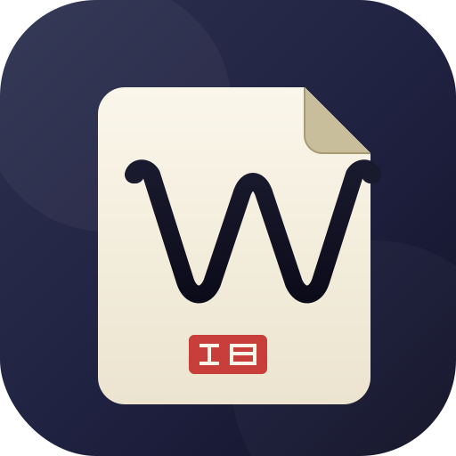

  

<h1 align="center">Woo · 无我笔记</h1>

  <strong>本地优先的 Markdown 笔记桌面应用</strong>

  
  
  

 

Woo 是一个本地优先的 Markdown 笔记应用，基于 Electron、Vue 3 和 SQLite 构建。数据默认存储在你的电脑上，无需注册即可使用全部核心功能。登录后可选择开启 Supabase 云端同步，实现多设备间的数据互通。

Woo 目前处于早期开发阶段（v0.4.7），核心功能已可用，部分特性仍在完善中。

> 「无我」出自佛教哲学，意为超越自我执念。以此命名，是希望提供一个简洁、干净的写作环境，让写作回归文字本身。

---

## 功能特性

### 本地存储，数据自主

所有笔记以 SQLite 数据库文件形式存储在本地，你可以随时复制、备份或迁移。不需要注册账号、不需要联网、不需要启动后端服务。下载安装后即可使用，数据不受任何外部服务约束。

### 所见即所得编辑

基于 Tiptap / ProseMirror 的富文本编辑器，支持标题、列表、代码块、引用、表格等常见 Markdown 格式。编辑与渲染合一，无需在编辑和预览模式间切换。编辑器带有自动保存机制（内容变更 800ms 后落盘），避免意外丢失。

### 文件夹与草稿

支持多层级文件夹树组织笔记，文档可在文件夹间拖拽排序。未分类的笔记自动归入草稿区（以 localStorage 暂存），整理后再移入正式文件夹。

### 跨平台

基于 Electron 构建，目前支持 Windows（7+）和 macOS（Apple Silicon）。Windows 使用无边框窗口与自定义标题栏，macOS 保留原生交通灯按钮。

### 可选云同步

登录后可开启 Supabase 同步，在多台设备间共享笔记数据。同步采用最后写入胜出策略解决冲突，通过增量推拉和墓碑标记传播删除操作。不登录即为纯本地模式，同步是可选项，不是依赖项。

### 版本历史

每次保存自动生成快照，采用 24 小时 / 7 天分层合并策略管理历史版本。支持查看变更差异和回滚到任意历史版本。删除的笔记先进入回收站（软删除），确认清理后才从数据库中移除，给误操作留出挽回余地。

### AI 助手（自建 Agent）

聊天面板内置 AI 助手，可接入 DeepSeek、Google Gemini 或任意兼容 OpenAI 接口的服务（需自备 API 密钥）。助手通过工具调用与本地笔记数据交互：

- **语义检索（RAG）** — 使用本地 BGE 向量模型对笔记做嵌入，检索相关内容后由 LLM 生成回答，无需手动翻找
- **笔记操作** — 可通过对话创建、修改、删除笔记和文件夹，AI 工具调用直接操作数据库
- **流式写入** — AI 生成的内容可逐字写入编辑器，写作过程实时可见
- **配置自由** — 支持自定义 API 地址、模型名称、系统提示词，可对接 Ollama、vLLM 等本地部署服务

### 多格式导出

支持将笔记导出为 Markdown、PDF、WebP 图片和思维导图（PNG / SVG），满足分享、打印、归档等场景。

---

## 📥 下载

<table>
  <tr>
    <td align="center"><b>Windows</b></td>
    <td align="center"><b>macOS</b></td>
  </tr>
  <tr>
    <td>
      <a href="https://github.com/stophemo/Woo/releases/latest">安装版 (.exe)</a> 
      <a href="https://github.com/stophemo/Woo/releases/latest">便携版 (.exe)</a> 
      <a href="https://github.com/stophemo/Woo/releases/latest">压缩包 (.zip)</a>
    </td>
    <td>
      <a href="https://github.com/stophemo/Woo/releases/latest">DMG (Apple Silicon)</a> 
      <a href="https://github.com/stophemo/Woo/releases/latest">压缩包 (.zip)</a>
    </td>
  </tr>
</table>

> 📎 所有安装包均可在 [GitHub Releases](https://github.com/stophemo/Woo/releases) 页面获取。移动端（Flutter）开发中。

---

## 📄 许可证

[MIT](LICENSE) © 2026 Stophemo

---

## 🌐 相关链接

- [项目主页](https://woo-notes.vercel.app)
